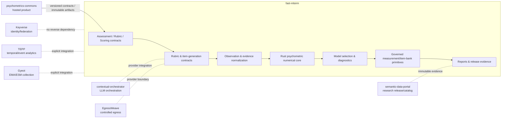
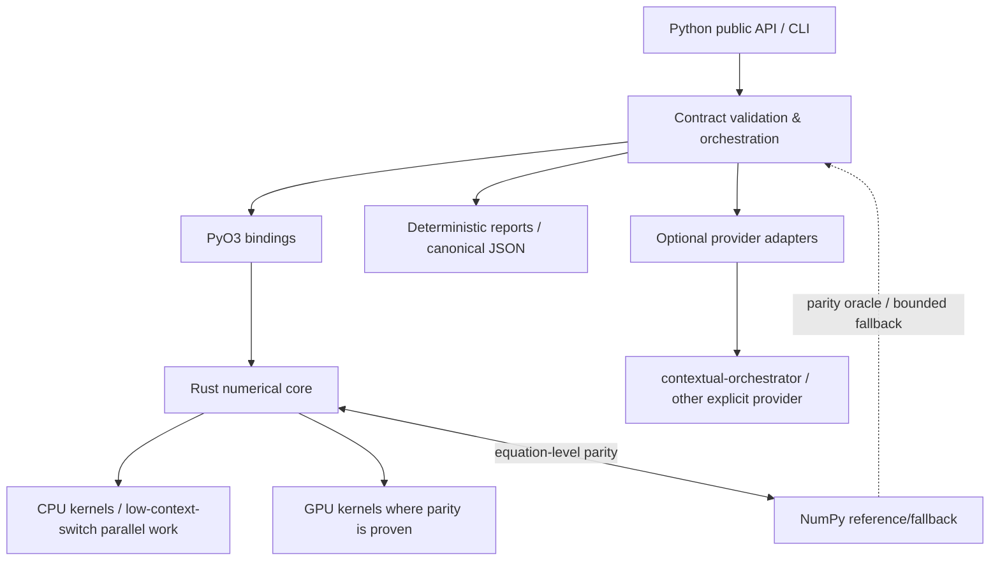
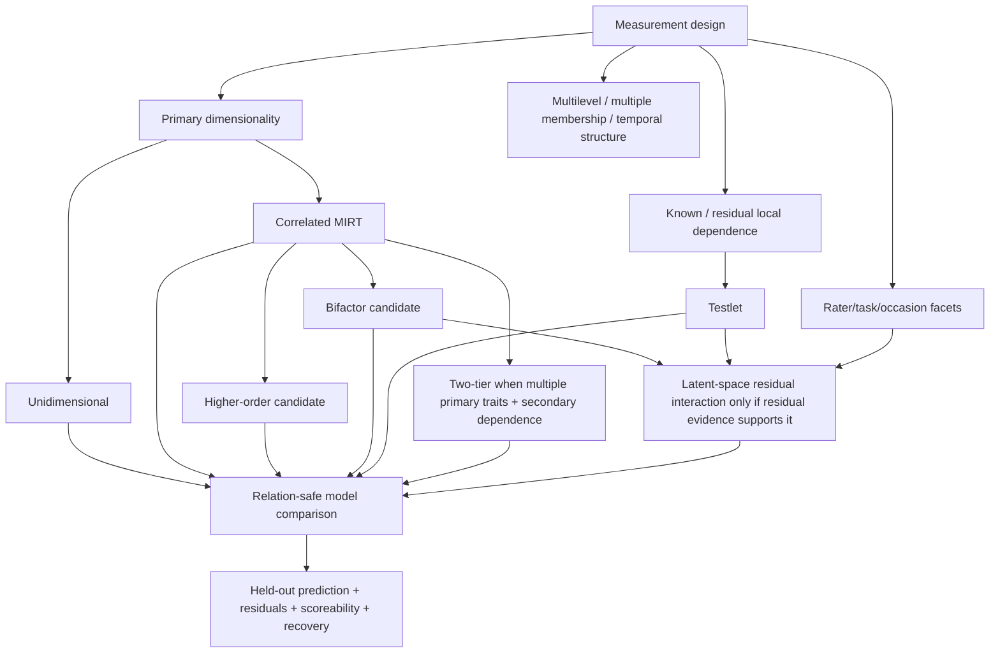
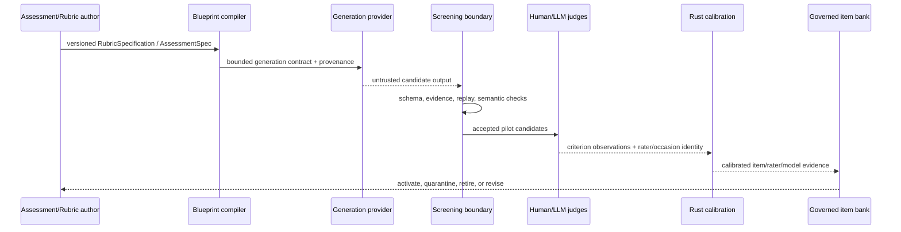
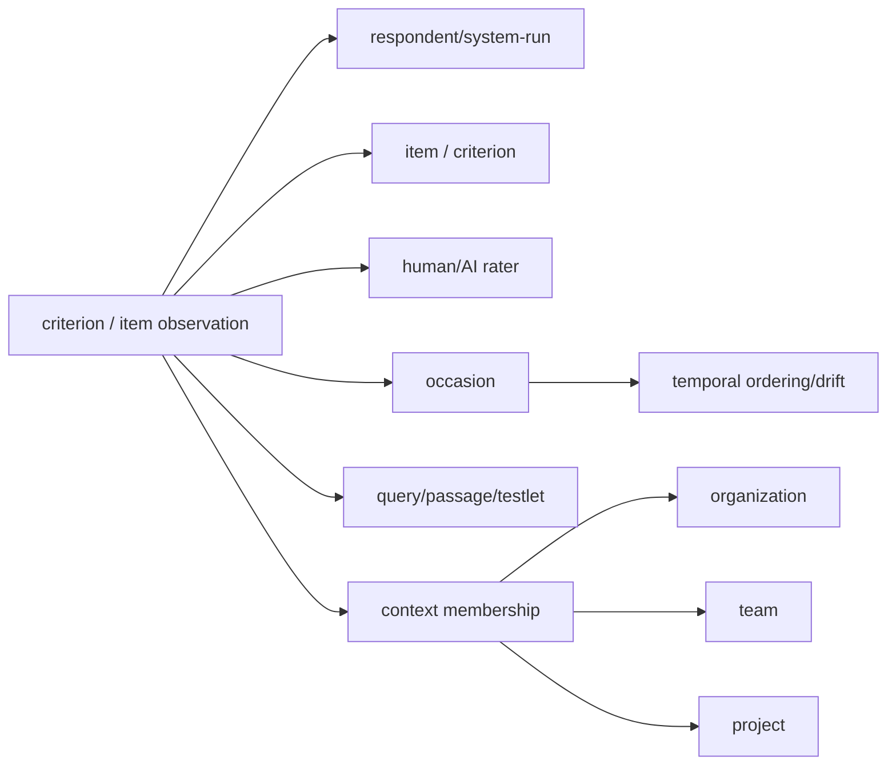

# fast-mlsirm Architecture

**Status:** Authoritative architecture baseline  
**Snapshot basis:** protected `main` at `4d910ed650f384ff882c8b5fba6a8b08fd532236` (2026-08-09)  
**Ownership:** `fast-mlsirm` is the reusable, domain-neutral measurement and psychometric computation layer. It is **not** the hosted Psychometrics Commons application.

This document is the architecture entry point. Product requirements live in [`docs/PRD.md`](docs/PRD.md), technical requirements in [`docs/TRD.md`](docs/TRD.md), decisions in [`docs/adr/README.md`](docs/adr/README.md), diagrams in [`docs/UML.md`](docs/UML.md) and [`docs/ERD.md`](docs/ERD.md), and conversation/research-to-code coverage in [`docs/traceability.md`](docs/traceability.md).

## 1. Architectural mission

`fast-mlsirm` turns observations from people, items/tasks, human or AI raters, rubrics, contexts, occasions, and generated evaluation probes into **versioned, auditable measurement evidence**. It owns reusable contracts and scientific/numerical truth; downstream products own participant/session lifecycle, product databases, HTTP APIs, consent, UI, deployment, and tenant administration.

The architecture is designed around five invariants:

1. **Rust owns production numerical arithmetic.** Python orchestrates, validates, marshals, and reports; retained NumPy paths are reference/fallback paths and must remain parity-checked.
2. **Measurement is not raw averaging.** Item difficulty/discrimination, rater severity/bias, local dependence, dimensional structure, uncertainty, DIF/invariance, and design connectedness are first-class.
3. **Hierarchy and time are explicit.** Multilevel, cross-classified, multiple-membership, testlet, longitudinal, occasion, and drift structures must not be silently flattened.
4. **LLM judges are fallible raters, not truth.** Reference-free evaluation separates groundedness, correctness, retrieval, utility, completeness, robustness, abstention, and citation evidence and calibrates evaluator behavior.
5. **Provenance fails closed.** Assessment, rubric, scoring, generation, calibration, model-selection, and report artifacts are versioned/content-addressed where the public contract requires it; unsupported or scientifically unidentified states do not silently become valid scores.

## 2. Bounded contexts

### Owned here

- `AssessmentSpec`, `RubricSpecification`, scoring and observation contracts.
- CTT/IRT/MIRT/MLSIRM numerical models and diagnostics.
- Many-facet, bifactor/higher-order/testlet/two-tier/multidimensional model primitives where implemented.
- DIF, invariance/fairness evidence, linking/equating, G-theory, CAT/ATA, recovery/simulation.
- Factor retention, relation-safe model comparison, adaptive rotation, scoreability diagnostics.
- Rater/judge calibration and automated-scoring validation.
- Rubric-to-blueprint/item-generation contracts and governed item-bank primitives.
- Standalone deterministic evidence reports and release/scientific acceptance tooling.

### Explicitly not owned here

- Hosted HTTP/admin APIs, participant/session/consent/results lifecycle.
- Product ORM/database migrations and customer tenant administration.
- Identity credentials/federation.
- Product UI and deployment composition.
- Generic LLM routing/provider credentials.
- Research-catalog persistence.

Those belong to their owning CWL services. `fast-mlsirm` must remain independently installable and must not depend on the hosted Psychometrics Commons runtime.

## 3. Runtime layers

### Python layer

`python/fast_mlsirm/` owns public types, CLI surfaces, immutable domain contracts, parsing, bounded validation, orchestration, and reports. It may retain a NumPy reference/fallback implementation when it is necessary for scientific parity or degraded operation, but new production numerical capability must not be duplicated in Python.

### Rust layer

`crates/mlsirm-core/` is the numerical source of truth. Numerical changes require realistic parameter-recovery or equation-level regression evidence. `crates/fast-mlsirm-py/` exposes Rust capabilities through PyO3. New feature-specific bindings must converge on one maintainable binding/export registry rather than accumulating mutually incompatible ad-hoc loaders.

### GPU layer

GPU is a device execution option of Rust-owned computation, not an independent scientific model. A GPU path is acceptable only after CPU/GPU parity, non-skip execution evidence, numerical-boundary tests, and recovery evidence appropriate to the method.

## 4. Measurement architecture

The package does not assume one universal model. Structural selection proceeds from the scientific question and observed design:

Model complexity is not evidence of validity. The selected model should be the **simplest identified model** that remains competitive in held-out prediction and satisfies residual-independence, scoreability, invariance/DIF, and true-parameter recovery requirements.

### Relation-safe comparison

Model names do not determine nesting. The comparison layer must distinguish regular nested, boundary nested, nonlinear-constraint nested, strictly non-nested, overlapping, indistinguishable, and unknown relations from actual parameter constraints. Normal-theory Vuong selection is not permitted before formal distinguishability evidence for non-nested/overlapping candidates. Boundary models require boundary-aware procedures such as parametric bootstrap likelihood-ratio tests.

## 5. Rubric, automated scoring, and reference-free evaluation

### Reference-free RAG

Reference-free does not mean truth-free. Evaluation contracts separate what can be supported by retrieved context from claims about world correctness or completeness. Candidate-blind evidence-grounded criteria are preferred for benchmark operation. Candidate-aware rubric discovery must be cross-fitted so the response used to discover criteria is not scored by the same discovered criterion without an independent split.

### Automated essay and enterprise issue evaluation

Human and AI scorers share a common observation contract. Human raw scores are not assumed to be error-free gold labels. Reliability evidence includes agreement and absolute error/calibration; many-facet analysis separates severity and other rater behavior. Enterprise issue prioritization must keep measurement separate from downstream business utility: psychometric discrimination is not policy criticality, and a high-stakes criterion can be a conjunctive gate even if it has low statistical discrimination.

## 6. Multilevel and temporal architecture

Every observation can belong to more than one context dimension and, where scientifically justified, to weighted multiple memberships. Context identity is dimension-qualified. Time is represented as ordered occasions and provenance; continuous-time dynamics require their own identified likelihood and recovery evidence and must not be inferred merely because timestamps exist.

Future estimators must fail closed when the requested random-effect/facet design is disconnected, confounded, or unidentified.

## 7. Security, privacy, and compliance posture

This repository designs toward SOC 2 and CSAP control evidence but does not claim certification. Controls are implemented through least privilege, explicit authority boundaries, immutable/provenanced artifacts, dependency/security scanning, bounded untrusted input, replay protection where applicable, secure packaging, reproducible evidence, and auditable release gates.

PII is not indiscriminately masked when doing so would destroy measurement usability. Instead, reusable contracts minimize raw sensitive content, prefer opaque identifiers and digests, and leave identity linkage, tenant authorization, encryption/retention, purpose limitation, and break-glass administration to the owning hosted product/service.

## 8. Quality gates

A scientific or production change is not complete because a unit test passes. Depending on scope, the evidence stack includes:

- Python and Rust unit/integration tests.
- PyO3 build/import and delegation tests.
- 100% owned production statement/branch coverage and public-docstring coverage where enforced.
- Numerical parity and finite-boundary tests.
- True-parameter bias, MAE/RMSE, coverage, convergence, information/probability recovery as appropriate.
- CPU/GPU parity and explicit GPU-no-skip evidence where a GPU path is claimed.
- DIF/invariance/fairness and rater-design connectedness where relevant.
- Security Scan, SAST, dependency review, fuzzing, packaging, SBOM/provenance where configured.
- Changelog rendering and release acceptance from the exact integrated protected head.

Correlation alone is not parameter-recovery evidence and passing in-sample fit alone is not a model-selection criterion.

## 9. Documentation governance

This file, `docs/PRD.md`, `docs/TRD.md`, the ADR set, UML, ERD, and traceability matrix are release-contract documentation. Material changes to ownership, public contracts, model parameterization, lifecycle, security boundary, execution authority, or release evidence must update the relevant document in the same PR or explicitly demonstrate no documentation impact.

Historical design notes and PR handoff documents remain useful evidence, but they are not substitutes for this authoritative set.

## 10. Primary references

- Cai, L. (2010). A two-tier full-information item factor analysis model with applications. *Psychometrika, 75*, 581–612.
- Fox, J.-P., & Glas, C. A. W. (2001). Bayesian estimation of a multilevel IRT model. *Psychometrika, 66*, 271–288.
- Jeon, M., Jin, I. H., Schweinberger, M., & Baugh, S. (2021). Mapping unobserved item-respondent interactions: A latent space item response model with interaction map. *Psychometrika, 86*, 378–403.
- Kang, I., & Jeon, M. (2025). Multidimensional latent space item response models: A note on the relativity of conditional dependence. *Psychometrika, 90*, 799–826.
- Molenaar, D., & Jeon, M. (2026). Regularized joint maximum likelihood estimation of latent space item response models. *Psychometrika, 91*, 335–359.
- Rijmen, F. (2010). Formal relations and an empirical comparison among the bi-factor, the testlet, and a second-order multidimensional IRT model. *Journal of Educational Measurement, 47*, 361–372.
- Rodriguez, A., Reise, S. P., & Haviland, M. G. (2016). Evaluating bifactor models: Calculating and interpreting statistical indices. *Psychological Methods, 21*, 137–150.
- Schneider, L., Chalmers, R. P., Debelak, R., & Merkle, E. C. (2020). Model selection of nested and non-nested item response models using Vuong tests. *Multivariate Behavioral Research, 55*, 664–684.
- Uto, M., & Ueno, M. (2020). A generalized many-facet Rasch model and its Bayesian estimation using Hamiltonian Monte Carlo. *Behaviormetrika, 47*, 469–496.
