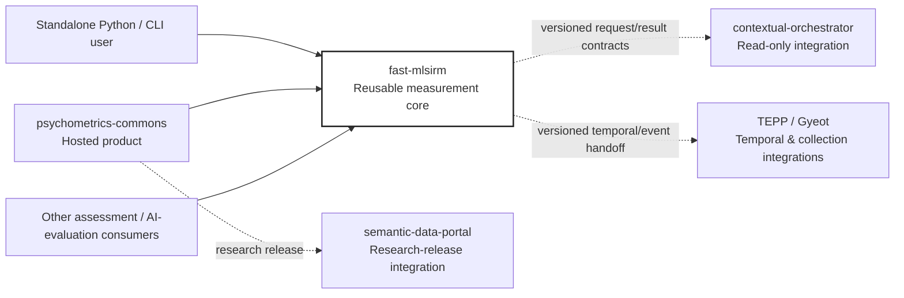
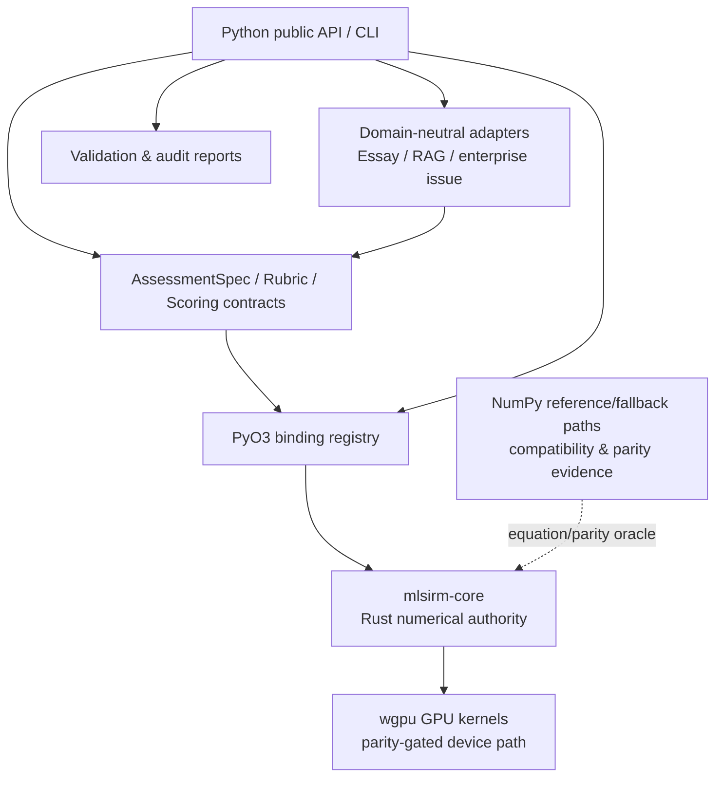

# fast-mlsirm Architecture

Status: **Authoritative architecture baseline**  
Last reconciled: **2026-08-09**

`fast-mlsirm` is the reusable, domain-neutral measurement and psychometric computation layer in the ContextualWisdomLab ecosystem. It owns versioned assessment/rubric/scoring contracts, item and rater observations, calibration and model diagnostics, linking, DIF/invariance/fairness evidence, factor/model selection, recovery/simulation, and Rust-first numerical kernels.

It is **not** the hosted assessment product. `ContextualWisdomLab/psychometrics-commons` is a downstream consumer and owns HTTP/admin APIs, participant/session/consent/result lifecycle, persistence and migrations, resource authorization, reference clients, deployment composition, and hosted-product operator UX. The dependency direction is one-way: hosted products consume versioned `fast-mlsirm` contracts and artifacts; this repository must never depend on hosted-product ORM, HTTP, UI, identity, or deployment types.

## Architectural principles

1. **Scientific claims are executable contracts.** Formula, scoreability, fit, model-selection, recovery, fairness, and interpretation claims require tests and primary-source doctoring.
2. **Rust is numerical authority.** Production psychometric arithmetic belongs in `crates/mlsirm-core`; Python owns public contracts, orchestration, validation, compatibility reference paths, and reporting. PyO3 is the reviewed bridge.
3. **No atomistic default.** Reusable designs must be able to represent contextual hierarchy, cross-classification, multiple membership, repeated occasions, and temporal ordering where the scientific question requires them. Unsupported structures fail closed rather than being silently flattened.
4. **Humans and LLM judges are fallible raters.** A judge output is an observation, not truth. Rater severity, disagreement, range use, criterion bias, drift, and insufficient-evidence states remain observable and calibratable.
5. **Model complexity is earned by evidence.** Correlated multidimensional, bifactor, higher-order, testlet/two-tier, multifaceted, and latent-space structures are related but non-interchangeable. Relation/nestedness, residual dependence, held-out prediction, scoreability, and recovery determine whether a more complex structure is justified.
6. **Generated content is untrusted.** Rubrics and item-generation requests are immutable/content-addressed; provider JSON must pass bounded structural, provenance, source, and later semantic/psychometric screening before it can enter a governed item bank.
7. **No hidden hosted persistence.** `fast-mlsirm` currently owns canonical artifacts, not a product database. Any future persistence layer requires an explicit ADR and must preserve standalone use.
8. **PII utility is preserved through governance, not blanket masking.** The reusable layer minimizes retained sensitive content, separates evidence from durable provenance, and supports downstream purpose limitation, authorization, encryption, retention, and audited access.

## System context



Dashed arrows are optional integration boundaries, not runtime dependencies of the core package.

## Component architecture



The retained NumPy paths are not a second scientific authority. They exist for compatibility, bounded fallback behavior where explicitly supported, and independent parity/recovery evidence.

## Core bounded contexts

### Measurement contracts

`python/fast_mlsirm/scoring/` and `python/fast_mlsirm/rubric/` own immutable domain-neutral contracts such as `AssessmentSpec`, `RubricSpecification`, scoring policies, observations, requests, and generated-item provenance. A rubric is defined once and referenced by exact fingerprints; downstream adapters must not fork parallel schemas.

### Item construction and generation trust boundary

The implemented boundary is:

```text
RubricSpecification
  -> BlueprintPlan / ItemBlueprint
  -> GenerationContract / GenerationRequest
  -> untrusted ItemGenerationProvider JSON
  -> strict parser + provenance/source validation
  -> GeneratedItemCandidate / GenerationExecution
```

Structural validation is not content validity. Ambiguity, answerability, semantic grounding, distractor quality, leakage, fairness, item fit, DIF, and calibration belong to later gates.

### Scoring and rater evidence

Human, LLM, and external engines are represented through shared scoring contracts. Missing, abstained, failed, and excluded outcomes remain distinct. Automated-scoring evidence must preserve exact rubric, task revision, rater/engine identity, and provenance so many-facet calibration and drift analysis can distinguish score meaning from evaluator behavior.

### Psychometric numerical core

`crates/mlsirm-core/` owns likelihoods, gradients, estimation kernels, fit/recovery diagnostics, linking, agreement, bifactor diagnostics, utility and related scientific arithmetic. `crates/fast-mlsirm-py/` exposes reviewed bindings. Production numerical changes require Rust tests plus Python delegation/parity where applicable.

### Model-selection and interpretation safety

A model being able to fit data is not permission to report every latent score. Selection must distinguish regular nested, boundary/nonlinear-constraint nested, strictly non-nested, overlapping, and unknown relations. Bifactor scoreability, factor rotation, residual/testlet dependence, rater effects, and dimensionality are separate evidence layers.

### Reports and release evidence

Reports serialize deterministic, accessible evidence; they do not silently turn diagnostics into consequential decisions. Release artifacts are cut only from an exact protected head with CI, security, coverage, package, scientific-recovery, provenance/SBOM, compatibility, review, and release-acceptance evidence.

## Cross-repository ownership

| Concern | Owner | fast-mlsirm relationship |
|---|---|---|
| Psychometric contracts and kernels | `fast-mlsirm` | Owns |
| Hosted assessment runtime, DB, consent, sessions | `psychometrics-commons` | Downstream consumer |
| Identity/federation | Keyverse | External integration |
| EMA/ESM collection | Gyeot | External integration |
| Temporal/event analysis | TEPP | External integration |
| Bounded LLM orchestration | contextual-orchestrator | Optional integration |
| Research catalog/release | semantic-data-portal | Downstream integration |
| Controlled egress | EgressWeave | External infrastructure |

No cross-service application database is shared. Interoperation uses explicit versioned APIs, events, or immutable artifacts.

## Data and persistence boundary

This repository does not currently own a hosted database. The canonical ERD in `docs/architecture/diagrams.md` is therefore a **logical artifact model**: it describes identities and provenance relationships among assessment, rubric, item, observation, calibration, model, and release evidence. It is not an ORM or migration schema. Introducing durable product persistence here requires an ADR proving that the data is reusable-core state rather than hosted-product state.

## Security and privacy boundary

- Fail closed on malformed, ambiguous, over-budget, non-finite, stale, replayed, or provenance-mismatched evidence.
- Keep provider/model credentials outside canonical measurement artifacts.
- Preserve least privilege and immutable workflow/action pins.
- Durable identifiers should be descriptive opaque handles rather than user-controlled numeric primary keys where practical.
- Raw source or PII is retained only when a specific reusable contract requires it; durable audit records prefer content digests, bounded metadata, purpose-specific references, and access-controlled downstream storage.
- Design for SOC 2 and CSAP evidence without claiming certification.

## Reliability and resource model

Scientific workloads use explicit resource ceilings, deterministic seeds where stochastic evidence must be reproducible, bounded subprocess/network/provider behavior, and scheduled/manual heavy recovery studies rather than unbounded PR latency. CPU kernels should use coarse-grained, low-context-switch parallelism; GPU execution is a parity-proven device path and must never be claimed when it is only a CPU fallback.

## Documentation authority

- `AGENTS.md`: contributor/agent governance and paper-first formula scope.
- `CLAUDE.md`: concise operating guide derived from the same architecture.
- `docs/product_requirements.md`: product requirements and non-claims.
- `docs/technical_requirements.md`: technical realization and quality gates.
- `docs/adr/`: material decisions and supersession history.
- `docs/architecture/diagrams.md`: executable UML/C4-style and logical ERD views.
- `docs/traceability_matrix.md`: conversation/research requirement -> code/test/evidence mapping.
- `docs/doctoring/`: primary-source scientific, standards, security, and interoperability evidence.
- `docs/superpowers/`: implementation plans/specs; useful history, not a substitute for accepted ADR/PRD/TRD authority.

Any conflict among accepted ADRs, PRD/TRD, and code is a release-blocking documentation defect. A changed accepted decision is recorded through a superseding ADR rather than by silently rewriting history.
