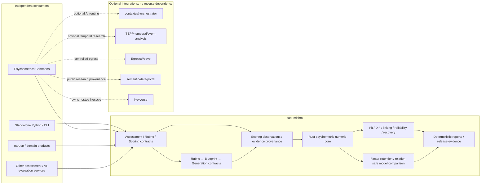
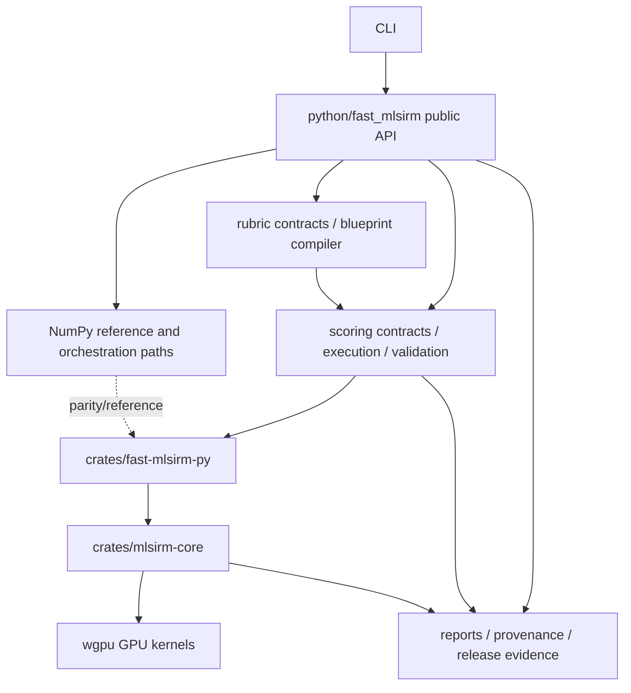
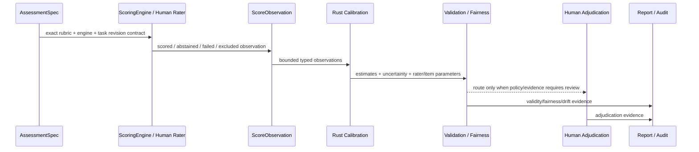
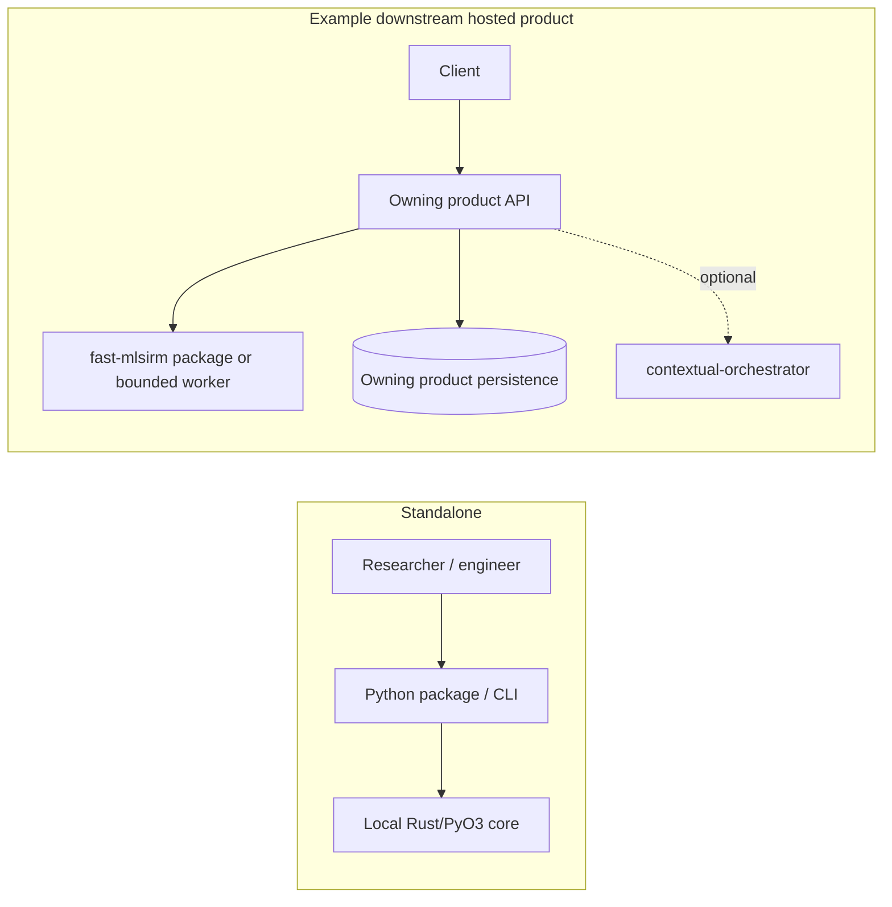

# fast-mlsirm Architecture

Status: **Canonical architecture description**  
Scope: `ContextualWisdomLab/fast-mlsirm`  
Architecture baseline: 2026-08-09

This document is the architecture description for `fast-mlsirm`. It follows the architecture-description concepts of ISO/IEC/IEEE 42010:2022 and is intentionally separate from product-hosting architecture. `fast-mlsirm` is the reusable, domain-neutral measurement and psychometric computation layer; hosted assessment lifecycle, identity, tenant persistence, HTTP/admin APIs, UI, and deployment composition belong to downstream products such as `ContextualWisdomLab/psychometrics-commons` or other owning services.

## 1. System of interest

`fast-mlsirm` provides reusable contracts and numerical methods for psychometric measurement, automated scoring, LLM-as-a-Judge calibration, reference-free evaluation, item generation/calibration workflows, model selection, linking, diagnostics, and evidence-oriented reporting.

The architecture must satisfy four simultaneous modes:

1. **Standalone library** — Python/CLI consumers can run locally without CWL services.
2. **Embedded module** — another application can import the same contracts and Rust-backed computations in process.
3. **MSA component** — services can serialize the content-addressed contracts/results across explicit boundaries without importing product internals.
4. **Scientific engine** — methods remain traceable to primary research, testable by recovery studies, and conservative about interpretation.

## 2. Stakeholders and concerns

| Stakeholder | Primary concerns |
|---|---|
| Psychometrician / researcher | identification, bias/RMSE/coverage, model fit, invariance, reproducibility, valid interpretation |
| Assessment / AI-evaluation engineer | stable contracts, rubric/version provenance, scorer interchangeability, fail-closed validation |
| Product engineer | small public API, deterministic behavior, packaging, performance, backward compatibility |
| Security / governance reviewer | bounded inputs, no raw-content leakage in governed artifacts, least privilege, immutable provenance |
| Buyer / auditor | evidence traceability, release reproducibility, model limitations, support boundary, rollback |
| Downstream CWL service | standalone operation, versioned interoperability, no reverse coupling to hosted-product concerns |

## 3. Architecture viewpoints

This architecture is maintained through the following viewpoints:

- **Product/requirements viewpoint** — `docs/PRD.md`.
- **Technical realization viewpoint** — `docs/TRD.md`.
- **Module and dependency viewpoint** — this document and `docs/architecture/UML.md`.
- **Information/provenance viewpoint** — `docs/architecture/ERD.md`.
- **Decision viewpoint** — `docs/adr/README.md` and individual ADRs.
- **Traceability viewpoint** — `docs/requirements_traceability.md`.
- **Scientific evidence viewpoint** — method-specific doctoring, papers, recovery studies, and citations.

## 4. Bounded-context map

### Boundary rules

- `fast-mlsirm` **does own** measurement contracts, scoring contracts, item/rater observations, calibration/model diagnostics, linking, DIF/invariance/fairness evidence, recovery/simulation, model/factor selection, and Rust-first numerical kernels.
- `fast-mlsirm` **does not own** authentication, product authorization, tenant/session/consent lifecycle, product database migrations, customer billing, hosted UI, deployment control planes, or research publication catalogs.
- `fast-mlsirm` may define **logical domain contracts** that downstream systems persist, but it must not require a particular ORM, database, queue, cloud, or web framework.
- Cross-repository integration is through versioned contracts, immutable artifacts, or explicit adapters; never hidden source coupling.

## 5. Module architecture

### Numerical ownership

- Production mathematical/statistical/psychometric arithmetic is **Rust-first**.
- Python owns input validation, immutable contracts, orchestration, marshaling, reference/parity implementations, and reporting.
- GPU is a device path under Rust, not a separate statistical implementation. A GPU path is production-credible only with CPU/GPU numerical or recovery parity appropriate to the algorithm.
- New mathematical kernels require explicit bounds, deterministic failure semantics, realistic true-parameter recovery where applicable, and 100% owned production statement/branch coverage.

## 6. Measurement workflow architecture

```mermaid
flowchart LR
    SPEC[AssessmentSpec] --> RUB[RubricSpecification]
    RUB --> BP[BlueprintPlan / ItemBlueprint]
    BP --> GC[GenerationContract]
    GC --> CAND[Validated candidate]
    CAND --> PILOT[Artificial crowd / human pilot]
    PILOT --> CAL[Calibration]
    CAL --> FIT[Fit / DIF / local dependence / scoreability]
    FIT --> BANK[Governed item-bank state]
    BANK --> SERVE[Operational use]
    SERVE --> MON[Drift / fairness / exposure monitoring]
    MON -->|deficient cell| BP
```

Structural conformance is never treated as psychometric validity. Candidate generation, semantic/evidence screening, pilot administration, calibration, item-bank approval, and operational monitoring are distinct gates.

## 7. Automated scoring and LLM-as-a-Judge architecture

LLM judges are fallible raters, not ground truth. Human raters are also observations with severity, consistency, range-use, and drift characteristics. Raw model/provider text is outside the governed numerical artifact unless an owning service deliberately stores it under its own privacy/security policy.

## 8. Model-structure and selection architecture

The library separates four questions that are frequently conflated:

1. **How many primary dimensions?** — factor-retention evidence.
2. **What latent structure?** — correlated MIRT, bifactor, higher-order, testlet, two-tier, many-facet, latent-space candidates.
3. **Are the candidate models formally comparable?** — regular nested, boundary/singular nested, constrained nested, strictly non-nested, overlapping, or unknown.
4. **Are resulting scores interpretable?** — scoreability/reliability, invariance/DIF, predictive/recovery evidence.

Selection must fail closed when the model relation or distinguishability requirement is unknown. A more flexible model is not selected solely because of in-sample fit.

## 9. Multilevel, multiple-membership, and temporal architecture

Atomistic analysis is not the default assumption for data that are structurally nested, cross-classified, multiple-membership, longitudinal, or rater-mediated.

The contract layer must be able to represent:

- context dimensions and dimension-qualified memberships;
- exact non-negative/positive weights with explicit normalization policy;
- nesting and cross-classification;
- multiple-membership assignments;
- respondent/task/rater/occasion relationships;
- ordered temporal occasions and task revisions;
- random-intercept/random-slope and discrete-time state specifications;
- future continuous-time transitions without pretending that elapsed clock time is already modeled.

Numerical estimators may be introduced only with identification rules, simulation/recovery evidence, and explicit treatment of confounded/disconnected designs.

## 10. Information and privacy architecture

Governed artifacts prefer content identities and minimal metadata over raw content:

- full SHA-256 fingerprints for exact normalized content identity;
- descriptive public handles where a stable external reference is required;
- explicit schema and semantic versions;
- stable error codes and paths that do not reflect rejected values;
- immutable/canonical serialization for replay and audit;
- raw response/source/prompt/provider text retained only by an owning upstream/downstream system when operationally required.

This is data minimization and purpose-bound handling, not blanket PII masking. A cryptographic fingerprint is an identity/provenance primitive, not authorization or a signature.

## 11. Reliability and evidence architecture

Every release-relevant claim must be tied to the exact artifact/head that was tested. Evidence classes remain separate:

- deterministic unit/property/recovery tests;
- Python↔Rust and CPU↔GPU parity where applicable;
- CI/package/import evidence;
- security and supply-chain evidence;
- automated review evidence;
- independent approval when required;
- release acceptance / artifact digests;
- buyer-facing reports.

Stale-head, predecessor-head, queued, cancelled, skipped-required, or status-only evidence is not promoted to exact-head proof.

## 12. Deployment modes

`fast-mlsirm` has no mandatory server deployment topology.

The hosted consumer owns persistence and service controls. `fast-mlsirm` remains independently installable.

## 13. Architecture fitness functions

Architecture drift should fail CI or release review when feasible. Key fitness functions include:

- package imports without hosted-product dependencies;
- production numerical paths resolve to Rust when the feature claims Rust ownership;
- reference/parity tests stay numerically aligned;
- new governed contracts preserve canonical identity and bounded input rules;
- database/ORM/web-framework imports do not enter the core package;
- raw sensitive content does not enter content-minimized governed artifacts;
- changelog/docs match public contracts;
- model-selection APIs do not return unsupported winners;
- scientific claims have primary-source doctoring and recovery evidence.

## 14. Authoritative companion documents

- `docs/PRD.md` — product requirements and roadmap boundaries.
- `docs/TRD.md` — technical requirements and quality attributes.
- `docs/architecture/UML.md` — context, component, class, sequence, and state diagrams.
- `docs/architecture/ERD.md` — logical information model; not a physical DB schema.
- `docs/adr/README.md` — architecture decision index.
- `docs/requirements_traceability.md` — requirement→design→evidence links.
- `docs/documentation_coverage.md` — documentation completeness audit.

## References

American Educational Research Association, American Psychological Association, & National Council on Measurement in Education. (2014). *Standards for educational and psychological testing*. American Educational Research Association.

ISO/IEC. (2023). *ISO/IEC 25010:2023 Systems and software engineering—Systems and software Quality Requirements and Evaluation (SQuaRE)—Product quality model*.

ISO/IEC. (2023). *ISO/IEC 5338:2023 Information technology—Artificial intelligence—AI system life cycle processes*.

ISO/IEC/IEEE. (2019). *ISO/IEC/IEEE 15289:2019 Systems and software engineering—Content of life-cycle information items (documentation)*.

ISO/IEC/IEEE. (2022). *ISO/IEC/IEEE 42010:2022 Software, systems and enterprise—Architecture description*.

ISO/IEC/IEEE. (2026). *ISO/IEC/IEEE 12207:2026 Systems and software engineering—Software life cycle processes*.

Object Management Group. (2017). *OMG Unified Modeling Language (OMG UML), Version 2.5.1*.
