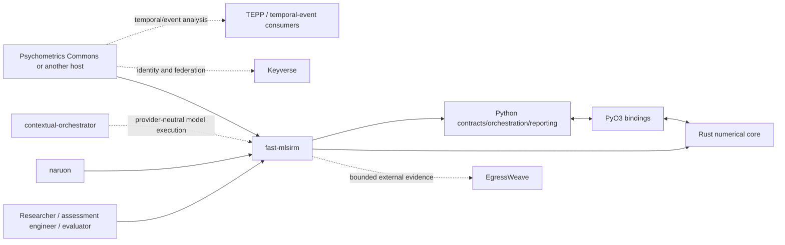
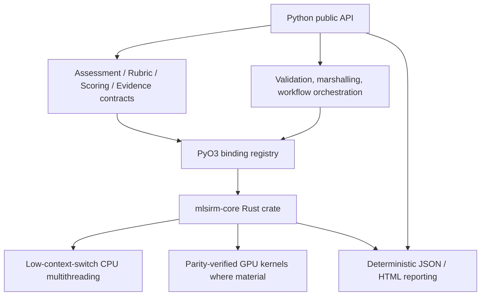

# fast-mlsirm Architecture

Status: authoritative architecture baseline for the reusable `fast-mlsirm` repository.

## Purpose and repository boundary

`fast-mlsirm` is the domain-neutral psychometric measurement and numerical-computation layer in the ContextualWisdomLab ecosystem. It must remain independently installable while also composing cleanly with organization services.

The repository owns:

- versioned assessment, rubric, scoring, item, rater, calibration, and evidence contracts;
- psychometric simulation, estimation, diagnostics, linking, DIF/invariance/fairness, factor/model selection, scoreability, recovery, and reporting;
- Rust-first mathematical kernels and their PyO3 product bindings;
- provider-neutral orchestration contracts for generated assessment content and evaluator observations;
- deterministic, auditable release and scientific-evidence artifacts.

The repository does **not** own hosted participant/session/consent lifecycle, product persistence/ORMs, tenant HTTP APIs, identity, deployment composition, or a hosted admin UI. `ContextualWisdomLab/psychometrics-commons` is the canonical downstream hosted product. Keyverse, contextual-orchestrator, EgressWeave, TEPP, Gyeot, naruon, and other CWL repositories are integrations, not hidden runtime dependencies.

## C4-style context

## Internal containers

### Python responsibilities

Python may validate bounded inputs, canonicalize identifiers, marshal arrays/contracts, orchestrate workflows, expose typed results, and render deterministic reports. Python must not become an independent production owner of likelihood, gradients, Hessians, optimization, psychometric scoring/ranking, utility arithmetic, or other numerical kernels that belong to Rust.

### Rust responsibilities

Rust owns production mathematical/statistical computation. CPU implementations should minimize synchronization and context switching while preserving determinism where required. GPU paths are added only when computationally material and must have explicit CPU/GPU parity evidence. NumPy/Python numerical paths may remain as reference/fallback implementations only when their scope is explicit and parity is verified.

## Measurement-model architecture

Model selection is layered rather than name-driven:

```mermaid
flowchart LR
    Retention[Factor retention / candidate order]
    Primary[Correlated MIRT / substantive primary traits]
    General[Higher-order vs bifactor general-factor hypothesis]
    Local[Testlet / local dependence]
    Facets[Judge / rater / task / occasion facets]
    Residual[Latent-space residual interaction]
    Decision[Scoreability and interpretation gate]

    Retention --> Primary --> General --> Local --> Facets --> Residual --> Decision
```

- Factor retention and structural model choice are separate decisions.
- Bifactor, higher-order, testlet, two-tier, multifaceted, and latent-space models are compared according to their actual parameter constraints and boundary conditions.
- Formal distinguishability precedes non-nested preference; boundary/singular comparisons require boundary-aware procedures such as parametric-bootstrap LR or predictive comparison.
- A well-fitting bifactor model does not authorize general/subscale score interpretation without scoreability evidence.
- Finite multi-start rotation returns the best observed solution, never a proof of a global optimum.

## Governed assessment-content lifecycle

```mermaid
flowchart LR
    Rubric[RubricSpecification]
    Blueprint[Blueprint / item-generation contract]
    Candidate[Untrusted generated candidate]
    Screening[Structural + semantic screening]
    Crowd[Artificial crowd / human + AI observations]
    Calibration[Rust calibration]
    Bank[Governed item bank]
    Serving[Versioned serving bundle]
    Monitor[DIF / drift / exposure / retirement]

    Rubric --> Blueprint --> Candidate --> Screening --> Crowd --> Calibration --> Bank --> Serving --> Monitor
    Monitor --> Rubric
```

Operational rubric/item versions are immutable. New wording, evidence, score boundaries, or semantic meaning creates a new version and requires linking/anchor evidence where cross-version comparisons are claimed.

## Automated scoring and essay evaluation

All human, AI, and external scoring engines emit the same observation/provenance contracts. Humans and AI are modeled as fallible raters rather than treating either as ground truth. Automated essay validation is designed around criterion-level evidence, rater/prompt provenance, agreement, severity/fit, fairness/DIF, drift, and human-review routing. Correlation with one human raw score is descriptive evidence only.

## Reference-free RAG and enterprise issue measurement

Reference-free evaluation treats LLM judges as noisy measuring instruments. Groundedness, correctness, completeness, retrieval relevance, evaluator severity, query/testlet dependence, and model-family effects remain distinct.

Enterprise issue measurement separates evidence/measurement from intervention decisions. Latent severity or importance is not itself the final priority. Any consequential priority layer must represent action alternatives, uncertainty, cost, expected net intervention value, urgency from delay, and value of information; causal or high-stakes claims require an identified design and human validation.

## Multilevel, multiple-membership, and time

To avoid atomistic fallacy, measurement contracts must support nested, cross-classified, and weighted multiple-membership contexts where relevant. Longitudinal designs preserve explicit respondent/occasion identity, revision provenance, ordering, and temporal semantics. Discrete occasion-step AR parameters must not be silently reinterpreted as continuous-time effects. Continuous-time behavior requires a separately identified transition model and recovery evidence.

## Data and privacy boundary

`fast-mlsirm` is persistence-neutral. It does not require an ORM or application database. Durable hosts may persist the logical entities described in `docs/ERD.md` while retaining their own tenant, consent, authorization, retention, and migration responsibilities.

PII protection must not default to blanket masking that destroys measurement, longitudinal, multiple-membership, audit, or adjudication utility. Preferred controls are purpose-bound authorization, least privilege, tenant isolation, pseudonymous/opaque identifiers, selective disclosure, field/envelope encryption, isolated identity/token vaults, bounded retention/export, data-residency controls, and tamper-evident audit evidence.

## Quality and release gates

Release candidates require, on one exact integrated protected head where applicable:

- complete repository CI and current-head review evidence;
- 100% owned-production statement and branch coverage plus line/function/region coverage where tooling exposes it;
- beginner-readable public docstrings/rustdoc;
- Rust/PyO3/package/reinstall acceptance;
- Security Scan, SAST, dependency and supply-chain gates;
- true-parameter recovery with bias/MAE/RMSE/coverage/convergence rather than correlation-only claims;
- CPU/GPU parity for material GPU kernels;
- migration/rollback and provenance/SBOM/reproducibility evidence;
- rendered `CHANGELOG.md` and version bump only when the integrated vertical slice is release-ready.

## Standards and research governance

Current governing references include ISO/IEC 25010:2023 for software product quality, ISO/IEC 42001:2023 for AI management-system governance, NIST AI RMF 1.0 and its Generative AI Profile for risk-management/TEVV practices, the Standards for Educational and Psychological Testing for validity/fairness/use arguments, and primary psychometric literature cited in method-specific doctoring. Standards and papers constrain claims; they do not substitute for empirical recovery or operational evidence.

## Related documents

- `docs/PRD.md`
- `docs/TRD.md`
- `docs/UML.md`
- `docs/ERD.md`
- `docs/documentation_coverage_matrix.md`
- `docs/adr/ADR-0001-product-boundaries-and-scientific-governance.md`
- `AGENTS.md`
- `CLAUDE.md`
- method-specific RFCs, doctoring records, Superpowers specs/plans, and `CHANGELOG.md`
