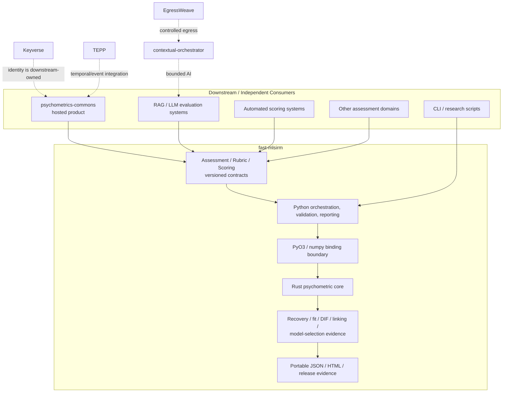
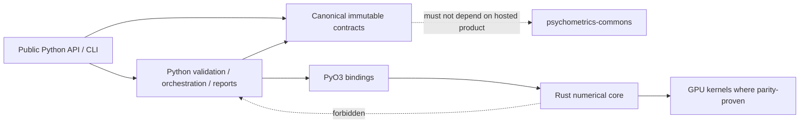
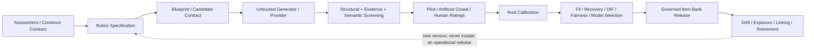
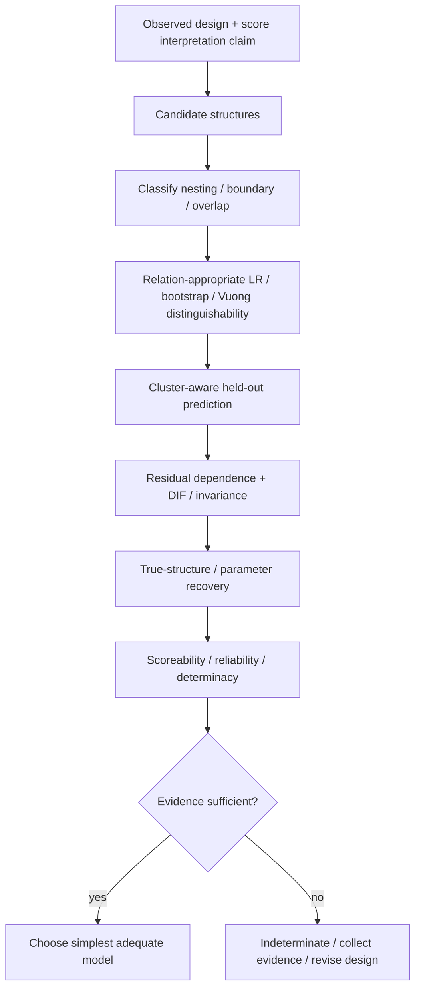

# fast-mlsirm Architecture Baseline

**Status:** Authoritative repository architecture baseline  
**Scope:** `ContextualWisdomLab/fast-mlsirm` only  
**Last reviewed:** 2026-08-09

## 1. Purpose and bounded context

`fast-mlsirm` is the independently installable, domain-neutral measurement and
psychometric computation layer in the ContextualWisdomLab ecosystem. It owns
versioned assessment/rubric/scoring contracts, psychometric observations,
calibration and diagnostics, model/factor-selection evidence, linking,
DIF/invariance/fairness evidence, recovery/simulation, and Rust-first numerical
kernels.

It does **not** own a hosted assessment product. Product HTTP/admin APIs,
participant/session/consent/result lifecycle, product persistence and migrations,
resource authorization, reference clients, research-release orchestration, and
deployment composition belong to `ContextualWisdomLab/psychometrics-commons` or
the relevant downstream service. A hosted `services/assessment_runtime` must not
be recreated here.

Other ecosystem repositories are integrations rather than hidden dependencies:
Keyverse owns identity/federation; TEPP owns broader temporal/event analysis;
Gyeot owns EMA/ESM collection; semantic-data-portal owns research catalog and
release provenance; contextual-orchestrator owns bounded LLM orchestration; and
EgressWeave owns controlled external egress.

## 2. Architecture principles

1. **Rust numerical source of truth.** Psychometric likelihoods, fitting,
   diagnostics, recovery calculations, and performance-sensitive mathematical
   kernels belong in Rust. Python validates, orchestrates, marshals and reports.
2. **Parity before acceleration.** CPU reference behavior is the numerical
   contract. GPU paths must demonstrate CPU/GPU parity before becoming accepted
   evidence; acceleration cannot change model semantics.
3. **Paper-first model evolution.** Model-formula changes require primary
   methodological grounding, explicit parameterization, analytic-gradient
   contracts, simulation/recovery evidence, documentation, and Rust/Python
   integration as one coherent change.
4. **Measurement is not a raw correlation.** True-parameter bias, MAE/RMSE,
   uncertainty/coverage, convergence, response-function/information recovery,
   DIF/invariance, and decision consequences are primary evidence. Correlation is
   descriptive evidence only.
5. **Fail closed on scientific ambiguity.** Unknown model relationships,
   unsupported distinguishability claims, unidentifiable structures, incomplete
   provenance, malformed untrusted artifacts, or insufficient evidence do not
   silently produce a winner or deployment claim.
6. **Immutable provenance.** Material contracts and generated artifacts are
   versioned/content-addressed so an exact assessment, rubric, scoring execution,
   model, source revision, and release can be reconstructed.
7. **Hierarchy and time are first-class.** When data contain organizational,
   cross-classified, multiple-membership, testlet, rater or longitudinal
   structure, analysis must not flatten those levels into an atomistic
   individual-only model.
8. **No universal best model or rotation criterion.** Candidate structures are
   compared with relation-aware inference, predictive validation, recovery and
   stability evidence; simpler scientifically adequate models are preferred.
9. **LLM/human judges are measurement instruments.** Judge outputs are not truth
   merely because they agree. Severity, discrimination, range use, drift,
   subgroup behavior, uncertainty and evidence provenance remain observable
   measurement concerns.
10. **Modular MSA boundary.** Downstream services consume explicit, versioned
    contracts or immutable artifacts. They do not join internal databases or
    reach through implementation boundaries.

## 3. System context

Dashed edges are ecosystem integrations and do not imply a runtime dependency
from `fast-mlsirm` back into those repositories.

## 4. Internal layers and dependency direction

The arrows labelled `forbidden` describe a prohibited dependency direction.
The compiled core must not call Python product logic; canonical contracts must
not acquire hosted-product fields simply to satisfy one downstream consumer.

## 5. Measurement and evaluation lifecycle

The target reusable lifecycle is intentionally broader than a single model fit:

### Current-state legend

- **Implemented on protected main:** reusable MLSIRM/IRT fitting and diagnostics,
  Rust/PyO3 numerical path, recovery and release evidence, Assessment/Rubric/
  Scoring contracts, rubric-centered blueprint/generation contracts, automated
  scoring/essay/enterprise adapters and governed reporting surfaces documented by
  the repository.
- **Active PR / convergence work:** multilevel and longitudinal contract
  hardening, selected NumPy fallback resource/performance contracts, reliability
  evidence and UX/report refinements.
- **Planned product convergence:** full governed dynamic item-bank lifecycle,
  semantic screening and artificial-crowd orchestration, broader joint
  many-facet/multidimensional model families, relation-complete formal model
  selection, and additional parity-proven GPU kernels.
- **Downstream:** hosted workflows, persistence, identity, consent, tenant
  authorization and buyer UI.

## 6. Scientific model-selection architecture

Model fit and score interpretation are separate gates.

A bifactor model, latent-space term, testlet term, rater facet, multilevel term or
rotation selector is not accepted merely because in-sample fit improves.
Identification, recovery, predictive performance, interpretability, and the
intended score claim must all remain defensible.

## 7. Multilevel, multiple-membership and temporal boundary

Reusable measurement contracts may represent nesting, cross-classification,
weighted multiple membership, occasions, rater/task facets and repeated
measurement. Mathematical likelihood/integration/gradient work remains Rust
owned and requires identification and recovery evidence before release.

Broader event graphs, trajectories and cross-service longitudinal analytics are
TEPP responsibilities. A fast-mlsirm contract may hand off exact versioned
measurement/occasion evidence; it must not become a second TEPP implementation.

## 8. Data and artifact architecture

This repository does not require a product database. Its authoritative data
model is a **logical canonical-artifact model**, documented in
`docs/architecture/logical-data-model.md`. If persistence is ever introduced in
this repository, an ADR must first establish that the persistence is genuinely
reusable library/tooling infrastructure rather than hosted-product ownership.
Any database object then uses a descriptive name of at least two words, with
`snake_case` preferred, and must include migration/rollback/data-lifecycle
contracts.

## 9. Security, privacy and AI boundary

- Untrusted JSON/provider output is bounded, closed-schema and fail-closed.
- Raw provider/source content is not reflected in stable error messages.
- Sensitive content is retained only when the exact reusable contract requires
  it; provenance prefers digests/opaque identities over ambient copies.
- No blanket PII masking is imposed where it destroys measurement utility.
  Purpose limitation, explicit authorization, encryption, selective disclosure,
  retention, auditability and controlled egress are preferred controls.
- GenAI-assisted features treat model output as untrusted evidence and preserve
  human-review/deployment boundaries.
- Model-backed automation uses the organization-approved NVIDIA NIM/OpenCode
  path when applicable and must not replace independent review credentials.

## 10. Build, verification and release evidence

A material release requires one exact integrated protected head with:

- Python statement/branch and public-docstring gates;
- Rust workspace and PyO3 tests, formatting/linting and numerical parity;
- explicit GPU no-skip evidence for GPU-owned contracts;
- fuzz/property tests at untrusted boundaries;
- security/SAST/dependency/supply-chain gates;
- packaging/reinstall/API compatibility evidence;
- true-parameter/known-oracle recovery appropriate to changed mathematics;
- rendered changelog and authoritative doctoring;
- reproducible/SBOM/provenance evidence where the release process supports it;
- qualifying independent review and zero valid unresolved findings.

Queued, cancelled, skipped-required, predecessor-head, synthetic-merge,
status-only, rate-limited or absent evidence is not exact-head success.

## 11. Documentation authority map

- `ARCHITECTURE.md` — repository bounded context and dependency architecture.
- `docs/PRD.md` — product requirements for the reusable measurement component.
- `docs/TRD.md` — technical requirements and acceptance mechanisms.
- `docs/adr/` — durable architecture/scientific decisions and supersession.
- `docs/architecture/uml.md` — component, sequence and state diagrams.
- `docs/architecture/logical-data-model.md` — logical ERD for canonical artifacts.
- `docs/requirements-traceability.md` — conversation/research requirement to
  implementation/evidence coverage matrix.
- `docs/doctoring/` and method-specific design documents — equation, method and
  standards traceability.
- `AGENTS.md` / `CLAUDE.md` — agent/operator guidance, not substitutes for PRD,
  TRD or ADRs.
- `CHANGELOG.md` and fragments — shipped/release-facing change history.

## 12. References

American Educational Research Association, American Psychological Association,
& National Council on Measurement in Education. (2014). *Standards for
educational and psychological testing*. American Educational Research
Association.

Jeon, M., Jin, I. H., Schweinberger, M., & Baugh, S. (2021). Mapping unobserved
item-respondent interactions: A latent space item response model with interaction
map. *Psychometrika, 86*(2), 378–403.
https://doi.org/10.1007/s11336-021-09762-5

Kang, I., & Jeon, M. (2025). Multidimensional latent space item response models:
A note on the relativity of conditional dependence. *Psychometrika, 90*(2),
799–826. https://doi.org/10.1017/psy.2025.5

National Institute of Standards and Technology. (2023). *Artificial intelligence
risk management framework (AI RMF 1.0)* (NIST AI 100-1).
https://doi.org/10.6028/NIST.AI.100-1

National Institute of Standards and Technology. (2024). *Artificial intelligence
risk management framework: Generative artificial intelligence profile*
(NIST AI 600-1). https://doi.org/10.6028/NIST.AI.600-1

International Organization for Standardization. (2023). *ISO/IEC 42001:2023
Information technology—Artificial intelligence—Management system*.

Schneider, L., Chalmers, R. P., Debelak, R., & Merkle, E. C. (2020). Model
selection of nested and non-nested item response models using Vuong tests.
*Multivariate Behavioral Research, 55*(5), 664–684.

Bray, T. (2017). The JavaScript Object Notation (JSON) data interchange format
(RFC 8259). RFC Editor. https://doi.org/10.17487/RFC8259

JSON Schema. (2022). *JSON Schema Draft 2020-12*.
