# Logical ERD — fast-mlsirm contracts

`fast-mlsirm` does not own an application database or ORM. This ERD defines a **persistence-neutral logical model** that downstream hosts may map to PostgreSQL, object storage, event stores, or other durable systems without importing host persistence into the psychometric core.

All example database object names use two-or-more-word `snake_case` names. Public identifiers are descriptive opaque strings; host systems may use UUIDv7/ULID or equivalent non-sequential identifiers.

```mermaid
erDiagram
    assessment_definition ||--o{ rubric_version : governs
    rubric_version ||--o{ rubric_criterion : contains
    rubric_criterion ||--o{ criterion_evidence : grounded_by
    rubric_version ||--o{ item_blueprint : compiles
    item_blueprint ||--o{ generation_contract : constrains
    generation_contract ||--o{ generated_item_version : produces
    generated_item_version ||--o{ item_evidence : cites
    generated_item_version ||--o{ score_observation : receives
    rubric_criterion ||--o{ score_observation : scores
    rater_profile ||--o{ score_observation : emits
    scoring_engine_version ||--o{ score_observation : emits
    measurement_occasion ||--o{ score_observation : contextualizes
    score_observation ||--o{ contextual_membership : has_context
    calibration_run ||--o{ score_observation : consumes
    calibration_run ||--o{ calibration_parameter : estimates
    calibration_run ||--o{ model_comparison_evidence : produces
    calibration_run ||--o{ scoreability_evidence : produces
    item_bank_version ||--o{ item_bank_entry : contains
    generated_item_version ||--o{ item_bank_entry : versions
    calibration_run ||--o{ item_bank_entry : qualifies
    item_bank_entry ||--o{ item_lifecycle_event : transitions
    validation_run ||--o{ score_observation : evaluates
    validation_run ||--o{ fairness_evidence : produces
    validation_run ||--o{ adjudication_case : routes
    release_bundle ||--o{ calibration_run : binds
    release_bundle ||--o{ validation_run : binds
    release_bundle ||--o{ item_bank_version : binds

    assessment_definition {
      string assessment_id PK
      string schema_version
      string construct_definition_hash
      string scoring_contract_hash
      string calibration_contract_hash
      string fairness_contract_hash
      string reporting_contract_hash
      datetime created_at
    }

    rubric_version {
      string rubric_version_id PK
      string assessment_id FK
      string rubric_id
      string semantic_version
      string rubric_fingerprint
      string lifecycle_state
      datetime created_at
    }

    rubric_criterion {
      string criterion_id PK
      string rubric_version_id FK
      string construct_id
      string criterion_scope
      string response_type
      string score_polarity
      string criterion_criticality
      string candidate_visibility
      string criterion_text_hash
    }

    criterion_evidence {
      string criterion_evidence_id PK
      string criterion_id FK
      string evidence_scope
      string document_id
      string span_id
      string content_hash
    }

    item_blueprint {
      string blueprint_id PK
      string rubric_version_id FK
      string construct_id
      string difficulty_target
      string evidence_mode
      string task_family
      string blueprint_fingerprint
    }

    generation_contract {
      string generation_contract_id PK
      string blueprint_id FK
      string contract_fingerprint
      string schema_version
      string response_format
      string provider_policy_hash
    }

    generated_item_version {
      string item_version_id PK
      string generation_contract_id FK
      string item_id
      string item_version
      string candidate_fingerprint
      string lifecycle_state
      datetime created_at
    }

    item_evidence {
      string item_evidence_id PK
      string item_version_id FK
      string source_id
      string span_id
      string content_hash
    }

    rater_profile {
      string rater_id PK
      string rater_family
      string rater_version
      string provider_identity_hash
      string capability_profile_hash
    }

    scoring_engine_version {
      string scoring_engine_version_id PK
      string engine_id
      string engine_version
      string configuration_hash
      string prompt_hash
    }

    measurement_occasion {
      string occasion_id PK
      string respondent_id
      integer sequence_index
      integer time_offset_milliseconds
      string occasion_revision_fingerprint
    }

    contextual_membership {
      string membership_id PK
      string observation_id FK
      string context_dimension_id
      string context_id
      decimal membership_weight
      string membership_revision_fingerprint
    }

    score_observation {
      string score_observation_id PK
      string item_version_id FK
      string rater_id FK
      string scoring_engine_version_id FK
      string occasion_id FK
      string subject_id
      string criterion_id FK
      string observation_status
      decimal score_value
      string observation_fingerprint
    }

    calibration_run {
      string calibration_run_id PK
      string model_family
      string model_relation_contract_hash
      string input_bundle_hash
      string implementation_version
      string exact_source_commit
      string run_fingerprint
    }

    calibration_parameter {
      string calibration_parameter_id PK
      string calibration_run_id FK
      string parameter_family
      string entity_id
      string dimension_id
      decimal estimate_value
      decimal standard_error
      string estimate_metadata_hash
    }

    model_comparison_evidence {
      string model_comparison_id PK
      string calibration_run_id FK
      string candidate_model_a
      string candidate_model_b
      string relation_class
      string distinguishability_status
      decimal predictive_delta
      string comparison_fingerprint
    }

    scoreability_evidence {
      string scoreability_evidence_id PK
      string calibration_run_id FK
      string evidence_family
      string interpretation_status
      string evidence_payload_hash
    }

    item_bank_version {
      string item_bank_version_id PK
      string bank_id
      string bank_version
      string linking_contract_hash
      string approval_state
      string bank_fingerprint
    }

    item_bank_entry {
      string item_bank_entry_id PK
      string item_bank_version_id FK
      string item_version_id FK
      string calibration_run_id FK
      string exposure_policy_hash
      string anchor_status
    }

    item_lifecycle_event {
      string lifecycle_event_id PK
      string item_bank_entry_id FK
      string previous_state
      string next_state
      string reason_code
      string evidence_hash
      datetime occurred_at
    }

    validation_run {
      string validation_run_id PK
      string assessment_id FK
      string calibration_run_id FK
      string validation_contract_hash
      string subgroup_contract_hash
      string run_fingerprint
    }

    fairness_evidence {
      string fairness_evidence_id PK
      string validation_run_id FK
      string group_definition_hash
      string criterion_id
      string evidence_type
      string evidence_payload_hash
    }

    adjudication_case {
      string adjudication_case_id PK
      string validation_run_id FK
      string subject_id
      string trigger_code
      string case_state
      string evidence_bundle_hash
    }

    release_bundle {
      string release_bundle_id PK
      string package_version
      string exact_source_commit
      string artifact_hash
      string sbom_hash
      string provenance_hash
      string rollback_contract_hash
      datetime created_at
    }
```

## Persistence rules

1. Operational rubric/item/calibration versions are append-only; semantic changes create new versions.
2. Identity mapping for real people belongs in the host identity/security boundary, not in the psychometric tables above.
3. Raw essays, source documents, prompts, retrieved context, CRM/VOC text, and other high-sensitivity payloads should be stored only by an authorized host when needed. Core evidence rows should prefer references and cryptographic fingerprints over ambient raw-text duplication.
4. Audit evidence is tamper-evident and tied to exact source/model/rubric/contract versions.
5. Tenant, legal basis, retention, residency, consent and erasure policy are host responsibilities and should be enforced before data is materialized into these logical entities.
6. A downstream persistence schema may normalize or partition these entities differently, but it must preserve their provenance and version semantics.

## Privacy note

The logical model intentionally avoids a blanket PII-masking requirement. Measurement and longitudinal workflows may require stable linkage. The preferred architecture is pseudonymous identifiers plus purpose-bound authorization, encrypted identity mapping in a separate trust domain, selective disclosure, retention controls and audited access.
