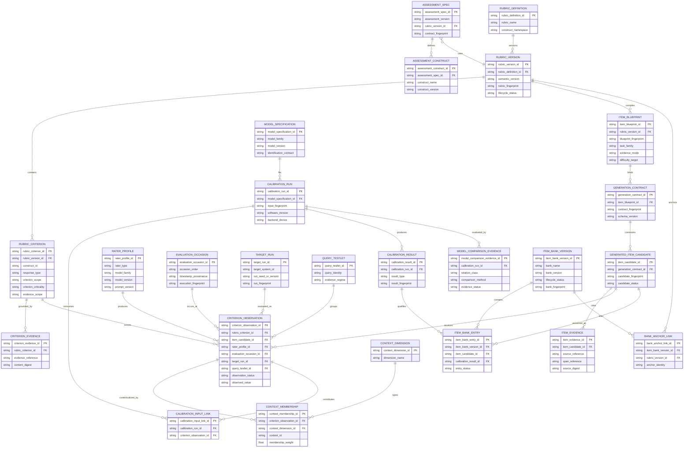

# fast-mlsirm Logical ERD / Domain Data Model

**Status:** Authoritative logical data model for reusable contracts.  
**Important:** `fast-mlsirm` does **not** own a hosted product database. This ERD documents domain relationships that downstream persistence may represent. It is not an instruction to add ORM models or migrations to this repository.

Database/persistence names shown here use descriptive two-or-more-word `snake_case` names. Durable public identities should be opaque/non-numeric where practical.

## 1. Logical ERD

## 2. Relationship semantics

### Assessment and rubric

An `assessment_spec` references one governed rubric revision for a given execution contract. Multiple assessment revisions can reuse the same rubric revision if the semantic scoring contract remains valid. A rubric definition has immutable versions rather than in-place edits.

### Rubric and item generation

A rubric version can compile many `item_blueprint` objects. A blueprint can produce one or more versioned `generation_contract` artifacts as the generation schema/provider constraints evolve. A candidate is accepted only against one exact generation contract and preserves its provenance.

### Evidence

`criterion_evidence` is evidence that defines or grounds a criterion. `item_evidence` is evidence used by a generated candidate. These are deliberately separate because a generated item can cite source spans that are not themselves the definition of the rubric criterion.

### Observations

`criterion_observation` is the normalized measurable event. It links the criterion/item, target/system-run, rater, occasion, and query/testlet. It may also link zero or more `context_membership` records across multiple context dimensions.

### Context and multiple membership

A context ID is not globally meaningful without `context_dimension_id`. A single observation may carry multiple memberships in one context dimension if the model/design permits weighted multiple membership. Weight validation is a contract concern, not a database trigger assumption.

### Calibration and model comparison

A `calibration_run` binds one exact model specification, input fingerprint, software version, and backend/device. Results are immutable evidence. Model comparison references fitted candidate evidence and records relation class/method/status rather than flattening all comparisons into one generic p-value.

### Item bank

An item bank is versioned. Entries refer to candidate identity and the calibration evidence used to admit them. Bank revisions use anchor/linking evidence rather than mutating the historical bank in place.

## 3. Automated scoring specialization

A human essay rater and an LLM essay scorer both map to `rater_profile`; the distinction is `rater_type` plus reproducible version metadata. Multiple rubric criteria share the same response target but remain distinct observations. A deterministic validation report is derived evidence; it is not the authoritative store of raw responses.

## 4. Reference-free RAG specialization

- RAG system configuration × run seed maps to `target_run`.
- Query and shared retrieved/evidence context maps to `query_testlet` and explicit evidence regime.
- Atomic groundedness/relevance/citation/robustness criteria map to `rubric_criterion`.
- Human/LLM judge model and prompt maps to `rater_profile` + `evaluation_occasion`.

The schema deliberately does not include a mandatory `reference_answer` because reference-free evaluation may not have one; evidence regime determines which claims are identifiable.

## 5. Enterprise issue specialization

Issue evidence and criteria can map to the same observation/rater/facet infrastructure. Stakeholder/business utility, intervention cost, uplift, and final resource-allocation decisions are **not** represented as item discrimination or calibration parameters. A downstream decision layer may reference calibration results.

## 6. Persistence boundary

A downstream service is free to normalize, denormalize, or event-source these relationships provided it preserves the public contract semantics. `fast-mlsirm` itself must not introduce a hidden product database merely to implement this ERD.

## 7. Naming and migration rules

- Persistent object names use two-or-more-word `snake_case` by default.
- Public IDs use opaque strings rather than auto-incremented numeric IDs where external exposure or cross-system correlation matters.
- Published artifacts are immutable; corrections create new revisions and supersession links.
- Breaking schema changes require explicit schema/version migration contracts.
