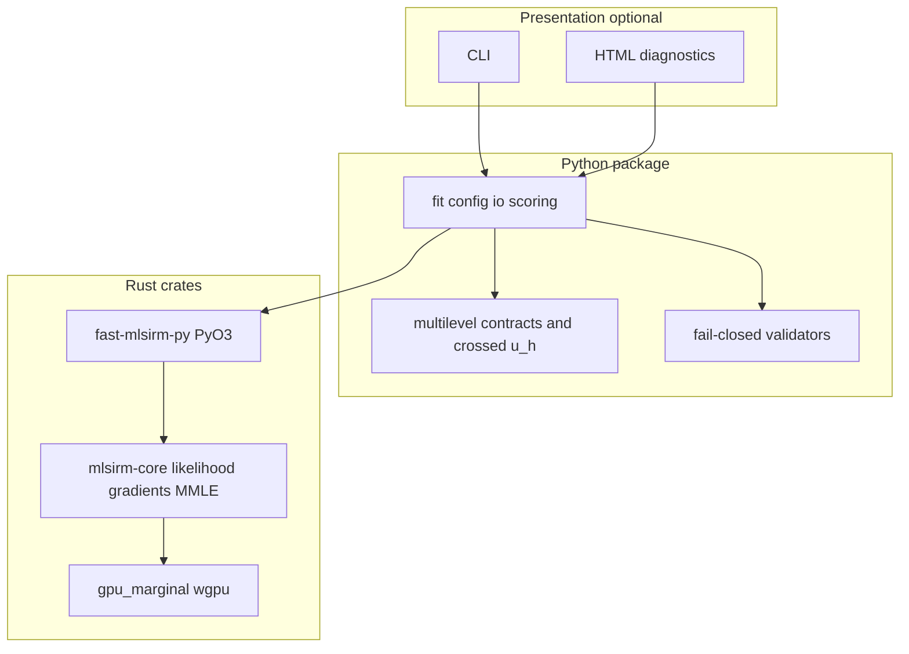

# Governance index — fast-mlsirm

Living index of architecture decision records, product/technical requirements,
security posture, test strategy, and operability artifacts. Pair with root
`ARCHITECTURE.md`, `AGENTS.md`, `CLAUDE.md`, and `CHANGELOG.md`.

## Document map

| Artifact | Role | Location |
| --- | --- | --- |
| Architecture | Layered Rust-primary numeric core + Python orchestration | `/ARCHITECTURE.md` |
| Agent / developer rules | Paper-first formula scope, review policy | `/AGENTS.md`, `/CLAUDE.md` |
| Product / technical requirements | MVP scope, formula contract, out-of-scope | `docs/prd_trd_summary.md` |
| MMLE / multigroup / multilevel design | Population structures, quadrature, EAP | `docs/mmle_marginal_lsirm_design.md` |
| Multilevel / multi-membership / temporal contracts | Atomistic-fallacy guards, longitudinal occasions | `python/fast_mlsirm/multilevel/`, `docs/doctoring/multilevel_longitudinal_measurement.md` |
| Doctoring (APA 7th) | Paper and standard citations for shipped claims | `docs/doctoring/` |
| Commercial readiness | Buyer packet / 20B product narrative gates | `docs/20b_product_readiness.md`, `docs/commercial_readiness.md` |
| Security | Bounded JSON, hostile control rejection, Strix/CodeQL CI | `SECURITY.md`, `docs/bounded_json_input_security.md` |
| Changelog fragments | Authoritative unreleased notes | `docs/changelog.d/`, `/CHANGELOG.md` |

## ADR index (lightweight)

| ID | Decision | Status |
| --- | --- | --- |
| ADR-001 | Rust is the primary numeric core; Python is orchestration/API | Accepted — `ARCHITECTURE.md` |
| ADR-002 | Population structures: single / multigroup / multilevel on MMLE path | Accepted — MMLE design + multilevel contracts |
| ADR-003 | Multiple-membership and temporal occasion contracts are content-addressed and fail-closed | Accepted — `fast_mlsirm.multilevel` |
| ADR-004 | CI matrix includes CPython 3.12 and 3.14; required check name is `python` | Accepted — `.github/workflows/ci.yml` |
| ADR-005 | LLM/agent automation uses `NVIDIA_NIM_API_KEY`; do not use `COPILOT_GITHUB_TOKEN` for agent paths | Accepted — org agent policy; review-bot keys unchanged |
| ADR-006 | PII handling prefers access control and purpose limitation over irreversible masking that blocks scoring | Accepted — commercial/security posture |
| ADR-007 | Buyer-review Figma evidence is file-ID-bound and Code Connect-disabled in the reusable core | Accepted — `docs/adr/0016-figma-buyer-evidence-design-boundary.md` |

## Threat model (summary)

```text
                    ┌──────────────────────┐
 Untrusted inputs → │ Python validation    │ → fail closed (no str/int/repr of hostile objs)
 (CSV, JSON, API)   │ bounds + type gates  │
                    └──────────┬───────────┘
                               ▼
                    ┌──────────────────────┐
                    │ Rust numeric core    │  no network; deterministic math
                    │ CPU multithread/GPU  │
                    └──────────┬───────────┘
                               ▼
                    ┌──────────────────────┐
                    │ Reports / packages   │  accessibility + integrity contracts
                    └──────────────────────┘

Supply chain: pin Actions SHAs, hash-locked requirements, CodeQL/Semgrep/OSV/Trivy/Strix.
Secrets: never in tree; agent keys separated from review-bot schemes.
```

STRIDE focus for this package:

| Category | Control |
| --- | --- |
| Spoofing | No hosted auth in core library; consumers supply IAM |
| Tampering | Content-addressed multilevel contracts; sealed factories |
| Repudiation | CI evidence jobs; changelog fragment authority |
| Information disclosure | Validation messages field-only; no reflection of hostile payloads |
| Denial of service | Bounded JSON depth; workspace budgets; fail-closed controls |
| Elevation | No privilege model inside library; OS/process isolation |

## Test strategy

| Layer | Evidence |
| --- | --- |
| Rust equation + recovery | `cargo test`; true-parameter recovery sentinels |
| Python API fail-closed | Hostile control suites (equating, exposure, node_rule, ATA, …) |
| Multilevel contracts | Factory seal, multi-membership weights, temporal order |
| GPU | Explicit parity vs CPU in CI (`gpu-smoke`) |
| Fuzz | Atheris CSV/report/config budgets |
| Release | `scripts/release_acceptance.py`, `scripts/sales_readiness.py` |

## Operability

- **Standalone install:** maturin/Rust toolchain for editable; wheels for consumers.
- **Observability:** fit diagnostics reports; JUnit in CI; coverage-evidence gate.
- **Incident response:** SECURITY.md; fail closed on missing Rust when backend requires it.
- **PII alternative to masking:** do not strip person identifiers required for measurement; enforce least-privilege storage, encryption-at-rest, and audit trails in deploying systems (SOC 2 / CSAP-aware).

## Traceability (example)

| Requirement | Design | Code | Test |
| --- | --- | --- | --- |
| MLS2PLM point estimate | PRD formula contract | `crates/mlsirm-core`, `fit.py` | recovery RMSE tests |
| Multilevel nesting | MMLE design + Fox & Glas (2001) | `PopulationSpec::Multilevel` + `estimate_crossed_person_effects` | multilevel recovery / contracts |
| Temporal occasions | Longitudinal contracts RFC | `TemporalOccasion` | `tests/test_multilevel_*.py` |
| Python 3.14 support | ADR-004 | `.github/workflows/ci.yml` | `tests/test_ci_python_314_contract.py` |

## UML — component view



## References (APA 7th)

Fox, J.-P., & Glas, C. A. W. (2001). Bayesian estimation of a multilevel IRT model.
*Psychometrika, 66*(2), 271–288. https://doi.org/10.1007/BF02294839

Jeon, M., Jin, I. H., Schweinberger, M., & Baugh, S. (2021). Mapping unobserved
item-respondent interactions: A latent space item response model with interaction map.
*Psychometrika, 86*(2), 378–403. https://doi.org/10.1007/s11336-021-09762-5

Kang, I., & Jeon, M. (2025). Multidimensional latent space item response models:
A note on the relativity of conditional dependence. *Psychometrika, 90*(2), 799–826.
https://doi.org/10.1017/psy.2025.5
