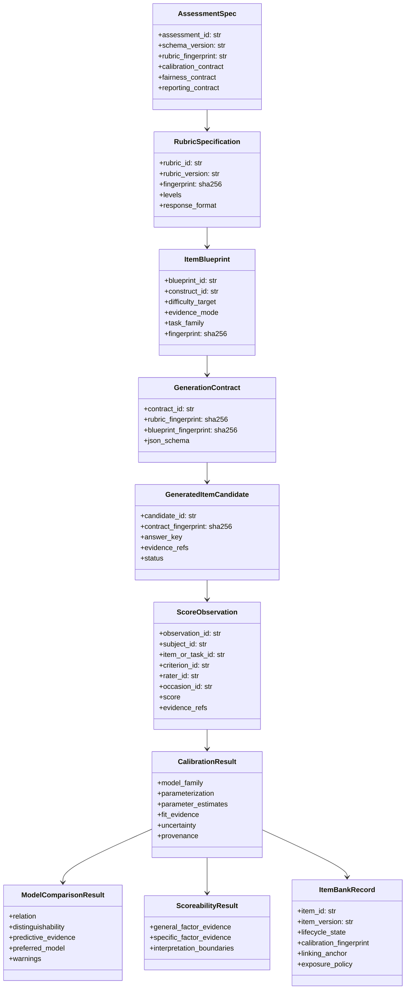
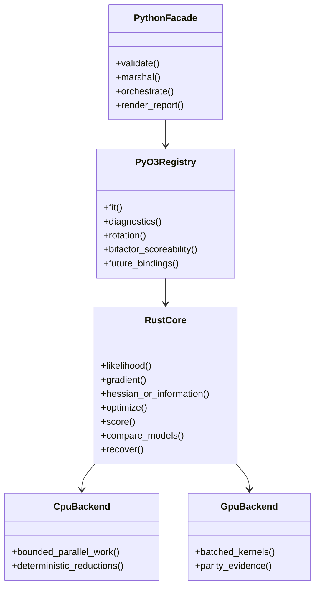
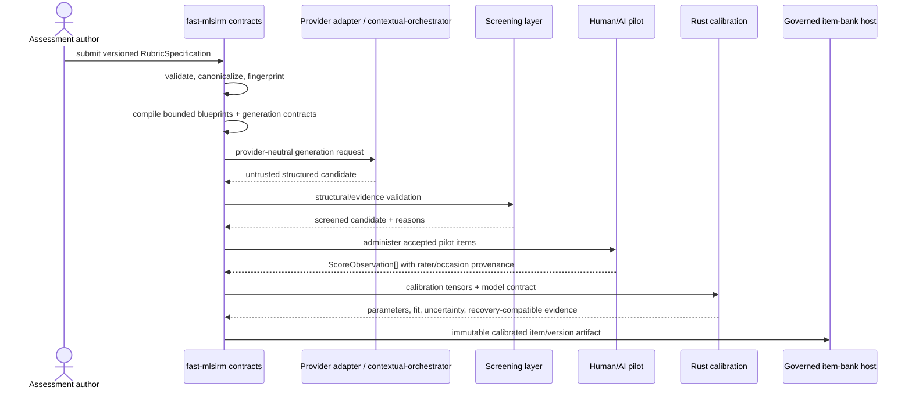
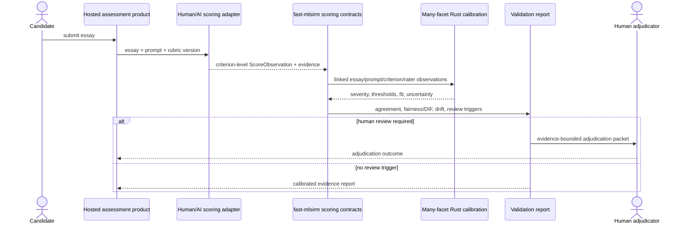
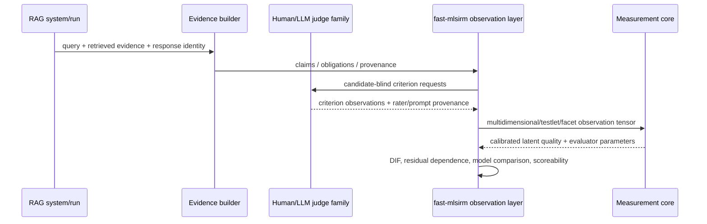
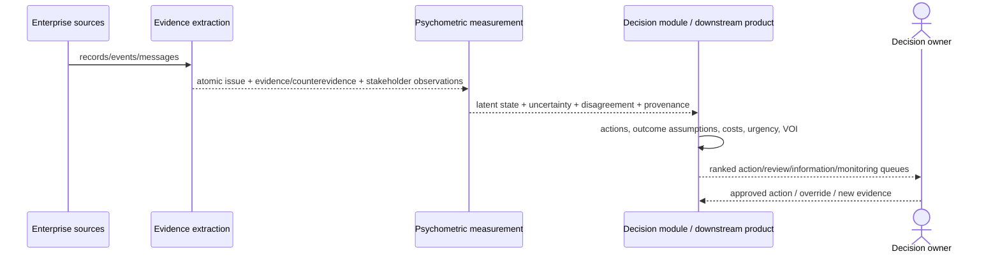
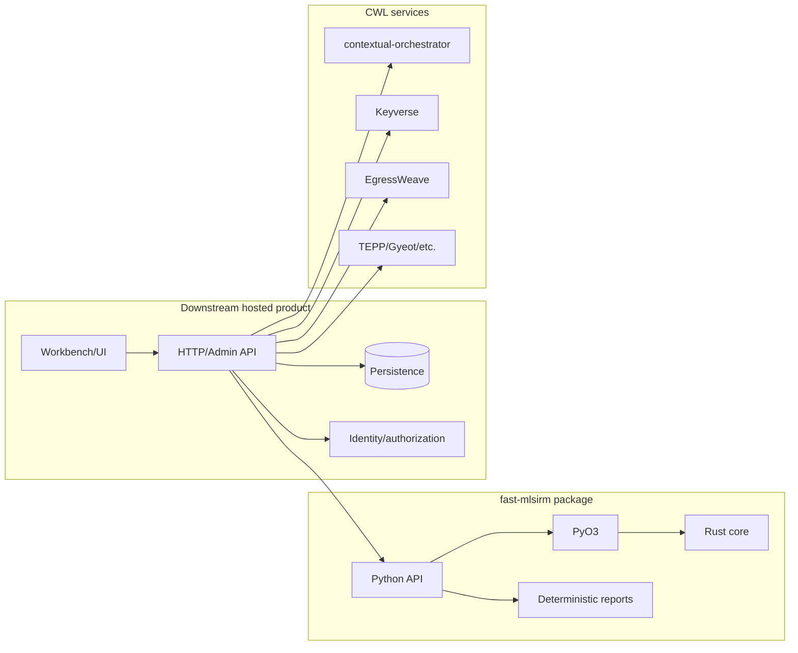

# UML Views — fast-mlsirm

These diagrams are logical views of the public product architecture. They intentionally avoid implying a hosted database or product runtime inside this repository.

## 1. Package/component UML



## 2. Numerical ownership UML



## 3. Rubric-to-item sequence



## 4. Automated essay scoring sequence



## 5. Reference-free RAG measurement sequence



## 6. Multilevel and longitudinal interaction

```mermaid
sequenceDiagram
    participant Host
    participant Contract as Context/occasion contracts
    participant Rust as Rust estimator
    participant Recovery as Recovery suite

    Host->>Contract: observations + context dimensions + membership weights + occasions
    Contract->>Contract: exact-type, connectedness, provenance and temporal validation
    Contract->>Rust: sparse contextual/longitudinal design
    Rust->>Rust: likelihood / gradient / optimization
    Rust-->>Host: estimates + fit + uncertainty
    Recovery->>Rust: simulated true parameters and realistic designs
    Rust-->>Recovery: recovered parameters
    Recovery->>Recovery: align scale/rotation; bias, MAE, RMSE, coverage, convergence
```

## 7. Enterprise issue measurement and decision boundary



## 8. Deployment/component boundary



The hosted product imports versioned `fast-mlsirm` contracts; `fast-mlsirm` does not import hosted product code.
