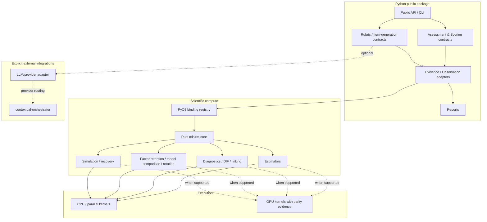
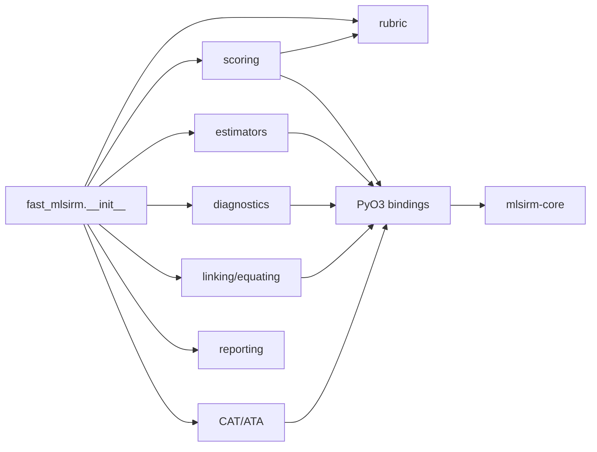
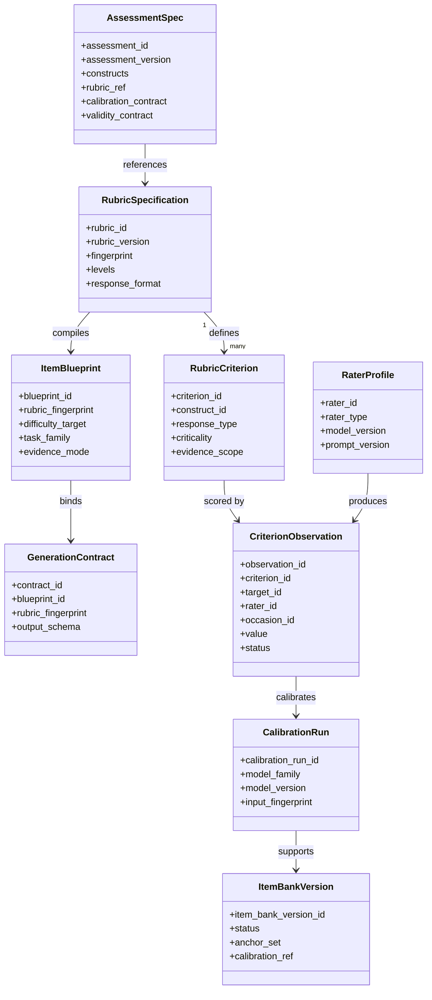
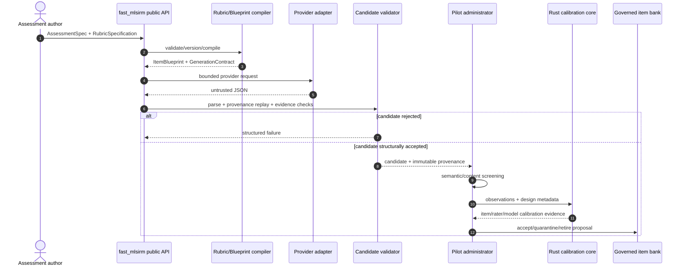
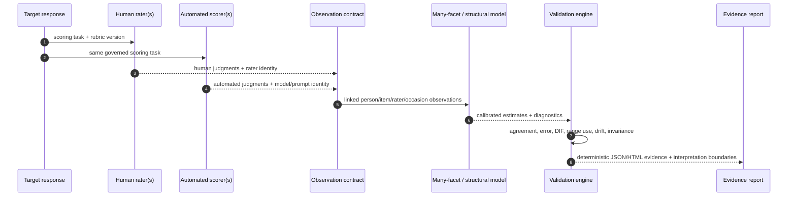
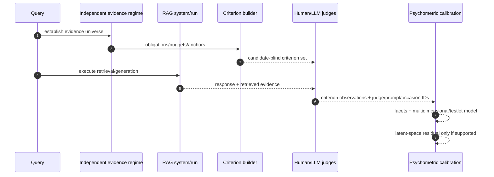
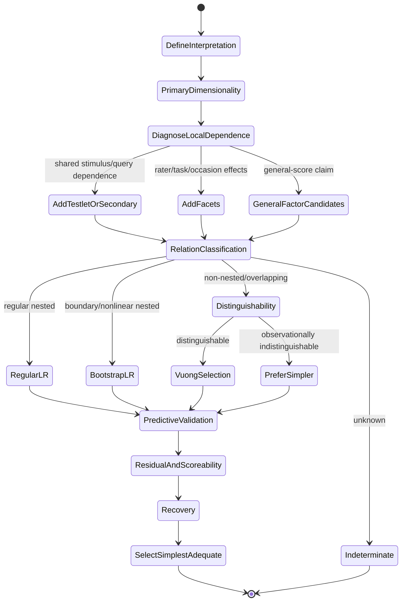
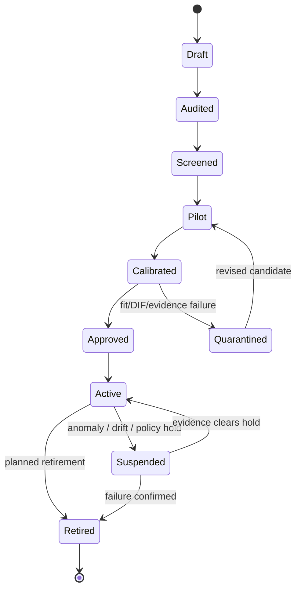
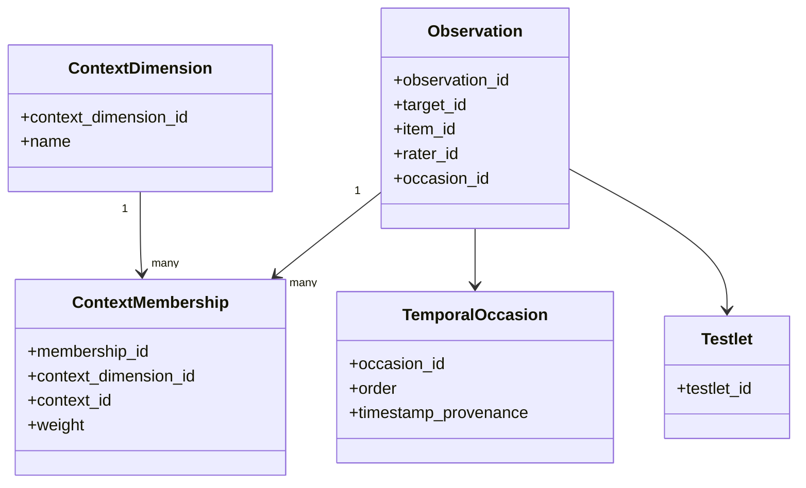
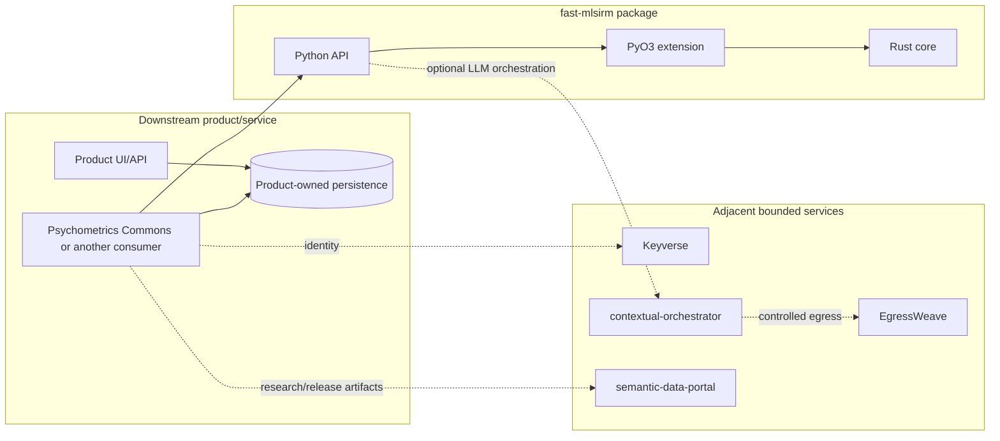

# fast-mlsirm UML and Interaction Views

**Status:** Authoritative diagram set accompanying `ARCHITECTURE.md`.  
**Notation:** Mermaid diagrams are maintained as text so review history and architecture changes remain diffable.

## 1. Component view

## 2. Package dependency view

Dependency direction is intentional. Domain-specific scoring modules may reuse generic rubric/assessment types. The rubric package must not depend on hosted product state. Numerical code must not call back into downstream hosted services.

## 3. Core domain class view

The class view is conceptual. Exact Python type names and fields are governed by source; the logical domain must not be mistaken for a SQL schema.

## 4. Rubric-to-item sequence

## 5. Automated-scoring sequence

## 6. Reference-free RAG sequence

A target response used to discover a candidate-aware criterion cannot be scored by that same discovery criterion without an independent fold if the result is intended for comparative benchmarking.

## 7. Structural model-selection activity

## 8. Governed item-bank lifecycle

Operational artifacts are immutable. Revision creates a new version rather than mutating an active object.

## 9. Multilevel / multiple-membership view

Context weight semantics, discrete occasion semantics, and any continuous-time parameterization are separate contracts.

## 10. Deployment/boundary view

There is no shared product database owned by `fast-mlsirm`.

## 11. Diagram maintenance rule

Update these diagrams when a material PR changes:

- bounded-context ownership;
- package dependency direction;
- public contract lifecycle;
- model-selection flow;
- context/temporal semantics;
- execution authority or device ownership;
- hosted/downstream integration boundaries.
