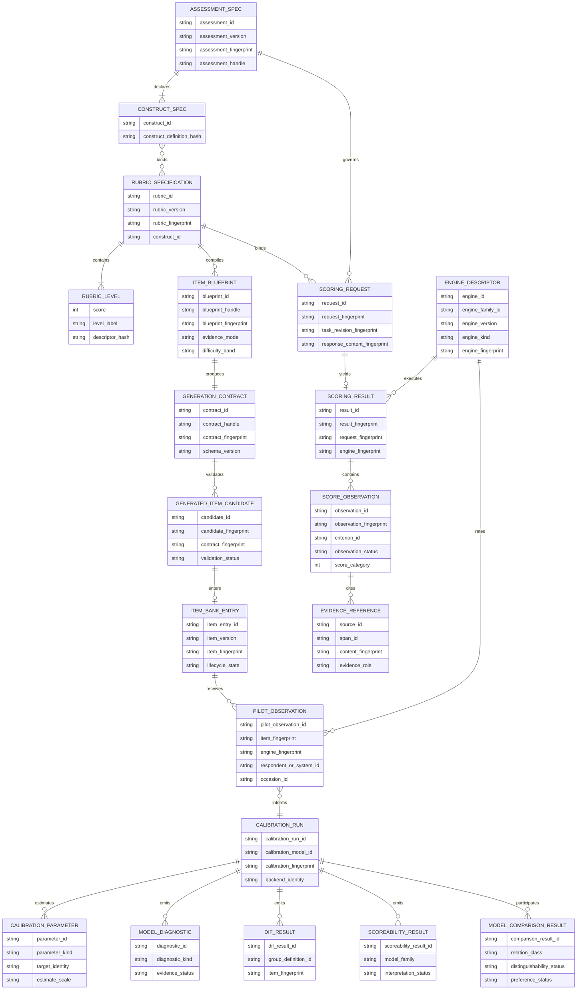
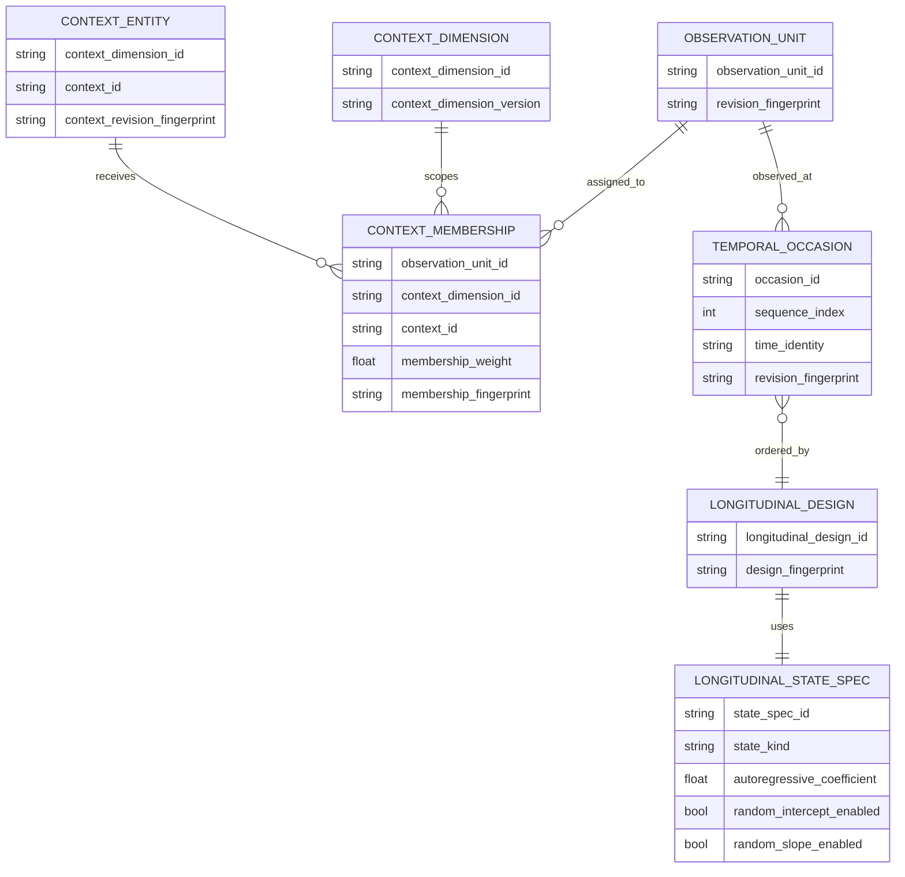

# Logical Contract ERD — fast-mlsirm

Status: architecture companion to `ARCHITECTURE.md`  
Important: this is a **logical information model**, not a physical database schema. `fast-mlsirm` does not require an ORM or own hosted-product persistence. A downstream product may persist these relationships under its own tenancy, authorization, migration, retention, encryption, and data-rights controls.

## 1. Core measurement/provenance ERD



## 2. Multilevel and temporal logical relationships



## 3. Persistence ownership rules

A downstream persistence implementation should preserve these semantics even if table names differ:

- durable public objects use opaque identifiers rather than sequential numeric public IDs;
- object/table names use descriptive two-or-more-word `snake_case` by default;
- full fingerprints are stored when replay/deduplication/audit depends on exact content identity;
- logical IDs and content fingerprints remain distinct;
- versioned content is append-only or superseded by a new version rather than mutated in place when historical interpretation matters;
- raw PII/source/response/prompt/provider text is not required by the core logical schema and should be stored only by an owning service under explicit purpose/retention controls;
- score/calibration/model evidence must remain linked to the exact rubric/task/item/engine/model revisions that produced it.

## 4. Suggested downstream physical names

These names are recommendations only for consumers that persist the contracts:

```text
assessment_specification
construct_definition
rubric_specification
rubric_level
item_blueprint
item_generation_contract
generated_item_candidate
item_bank_entry
scoring_request
scoring_result
score_observation
evidence_reference
engine_descriptor
pilot_observation
calibration_run
calibration_parameter
model_diagnostic
dif_result
scoreability_result
model_comparison_result
context_dimension
context_entity
context_membership
temporal_occasion
longitudinal_design
longitudinal_state_spec
```

Each name contains at least two descriptive tokens and follows the repository naming policy.

## 5. What is intentionally absent

This ERD does not define:

- user/account tables;
- tenant membership or RBAC tables;
- session/consent/result-access tables;
- billing/subscription tables;
- customer PII stores;
- LLM credential tables;
- deployment/runtime state;
- research publication catalog tables.

Those belong to the downstream product/service that owns the corresponding bounded context.
