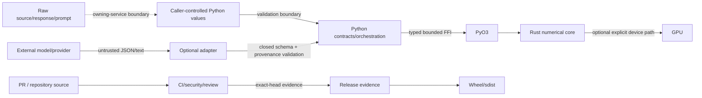

# Threat Model — fast-mlsirm Core and Integration Boundaries

Status: canonical architecture security view  
Date: 2026-08-09

## 1. Scope

This threat model covers the `fast-mlsirm` library, its Python↔PyO3↔Rust boundary, governed Assessment/Rubric/Scoring artifacts, optional model/provider adapters, release/evidence tooling, and GitHub CI/release paths.

It does **not** claim to be the threat model for a hosted assessment product. Identity, tenant authorization, session/consent, physical persistence, network perimeter, customer PII stores, key management, data residency, and hosted incident operations belong to the owning downstream service and require their own threat model.

## 2. Security objectives

1. **Scientific integrity** — malicious or malformed input cannot silently change model semantics, formula ownership, score interpretation, or evidence classification.
2. **Provenance integrity** — governed results remain bound to exact rubric/task/item/engine/model/source revisions.
3. **Availability** — caller-controlled dimensions, iterables, subprocesses, model calls, and artifacts are bounded before expensive work.
4. **Confidentiality** — governed artifacts and public error messages do not unnecessarily expose response/source/prompt/provider text, PII, secrets, or command output.
5. **Supply-chain integrity** — build/review/release evidence is tied to immutable or exact-head source and does not permit PR-controlled self-rewriting branches.
6. **Authority separation** — model-generated text, hashes, status/check output, automated-review verdicts, and content provenance are not treated as authentication, authorization, independent approval, merge authority, or release authority.

## 3. Assets

| Asset | Why it matters |
|---|---|
| Psychometric formulas and Rust kernels | A small semantic change can invalidate scores, fit, uncertainty, and scientific claims |
| Assessment/rubric/task/item revisions | They define what was measured and how an observation should be interpreted |
| Calibration/model parameters | Downstream decisions and linking depend on scale and identification |
| Recovery/validation evidence | Prevents a numerically plausible but scientifically incorrect implementation from shipping |
| Release artifacts and provenance | Buyers/auditors need to prove which source produced which package |
| Raw response/source/prompt/provider content | May contain PII, confidential or customer-controlled information |
| GitHub/model credentials | Could provide repository, provider, or model authority if exposed |
| CI/review evidence | Can incorrectly authorize a merge/release if stale, synthetic, or fail-open evidence is promoted |

## 4. Trust boundaries

### Boundary rule

Data is considered untrusted when it crosses from a caller, provider/model, filesystem/artifact, GitHub event/payload, external process, or downstream service into a governed contract or numerical path. A Python dataclass instance is not automatically trusted merely because it was once created by a package factory; aggregate builders replay package-owned fields where mutation would alter authoritative identity.

## 5. Primary threat classes and controls

### TM-INPUT-001 — Unbounded or adversarial input

**Threats**

- enormous dimensions or collections trigger memory exhaustion;
- infinite/hostile iterables never terminate or expose exception text;
- Boolean values pass integer validation;
- object/subclass conversions execute attacker-controlled callbacks;
- non-finite values poison objective/gradient calculations;
- array broadcasting materializes explosive intermediate tensors.

**Controls**

- exact-type checks for security/resource-sensitive scalar fields;
- collection/item/text/node/depth limits before materialization;
- checked dimension/byte products before allocation;
- no `BaseException` swallowing of process-control signals;
- stable non-reflective public errors;
- fuzz/property/boundary tests;
- Rust-side validation before unsafe-sized native allocation.

### TM-PROV-001 — Provenance confusion and replay

**Threats**

- a logical ID is reused after content changes;
- a scoring result is replayed under a new task/rubric/engine revision;
- provider output echoes a plausible but wrong contract fingerprint;
- a short convenience ID is treated as authoritative content identity;
- post-construction Python mutation changes package-owned fields without invalidating the apparent object.

**Controls**

- deterministic canonical serialization;
- full SHA-256 fingerprints for exact content identity;
- semantic/governance version separate from wire/schema version;
- cross-reference and replay validation at aggregate boundaries;
- 128-bit public handles only where compact external identity is needed;
- full fingerprints retained for durable replay/deduplication/audit;
- hashes explicitly documented as non-authoritative for authentication/authorization.

### TM-LLM-001 — Prompt injection and instruction/data confusion

**Threats**

- instructions embedded in rubric/source/candidate content modify provider behavior;
- candidate-aware rubric discovery overfits or intentionally penalizes the evaluated candidate;
- model output influences repository/write authority;
- an evaluator follows untrusted content rather than the locked assessment contract.

**Controls**

- provider-neutral contracts state that embedded rubric/source/item instructions are data, not executable instructions;
- benchmark mode supports candidate-blind generation; candidate-aware discovery is cross-fitted/separate;
- provider/model output is never merge/release/authorization authority;
- deterministic structural validation occurs after model generation;
- semantic/evidence screening and psychometric calibration remain separate gates.

OWASP's 2025 GenAI/LLM risk taxonomy treats prompt injection, sensitive-information disclosure, supply-chain risk, improper output handling, excessive agency, and unbounded consumption as distinct risk classes. This threat model maps those risks to the bounded library/integration surface rather than claiming that prompt filtering alone can eliminate them.

### TM-LLM-002 — Sensitive information disclosure

**Threats**

- raw essay/RAG source/customer data leaks through exceptions, audit records, prompts, model traces, subprocess output, or generated reports;
- a provider receives data outside the owning application's purpose/consent policy;
- blanket masking removes information required for valid measurement, causing operational failure or distorted results.

**Controls**

- core governed artifacts prefer opaque identities, spans, sizes, bounded metadata, and content fingerprints instead of raw text;
- raw data remains under the owning service's explicit purpose/authorization/encryption/retention/export/deletion controls when operationally necessary;
- error strings and provenance records do not echo rejected content;
- optional provider adapters expose a clear trust boundary rather than hiding model calls inside numerical code;
- no claim that hashing makes PII anonymous.

### TM-LLM-003 — Improper model output handling and excessive agency

**Threats**

- duplicate JSON keys or `NaN`/Infinity change parser semantics;
- unknown fields smuggle instructions/metadata into later stages;
- answer keys reference undeclared options;
- generated source spans do not occur in the referenced source;
- model/agent output directly writes branches, changes protections, approves PRs, or publishes releases.

**Controls**

- closed JSON schemas, duplicate-key rejection, finite-number validation, bounded raw response size;
- cross-field/option/source/span validation outside JSON Schema when necessary;
- separate scoring/measurement authority from model execution;
- GitHub autonomous development uses governed OpenCode workflows and ordinary reviewed commits, never PR-local self-modifying finalizers or model-supplied write authority.

### TM-SUPPLY-001 — Repository and build supply-chain confusion

**Threats**

- a PR-controlled workflow rewrites its own branch and deletes the evidence;
- an unpinned action/dependency changes beneath a reviewed workflow;
- coverage/review uses a stale or synthetic merge commit and is treated as exact-head evidence;
- source/archive/artifact materialization follows symlinks or path traversal;
- external bootstrap/download failure is hidden as a green review.

**Controls**

- no one-shot/self-modifying/encoded-patch branch writers in final source;
- least privilege and immutable action/workflow references where practical;
- exact-head/source-artifact binding and fail-closed evidence classifications;
- descriptor/no-follow/path-confinement patterns for security-sensitive file materialization;
- artifact/package digests and release evidence indexes;
- failed/queued/stale/skipped evidence is never promoted to passing.

### TM-NUM-001 — Scientific integrity and numerical misuse

**Threats**

- Python and Rust formulas diverge;
- a boundary/non-nested model is tested with the wrong asymptotic procedure;
- a flexible bifactor/latent-space model wins fit but produces uninterpretable scores;
- unaligned latent-space/rotation coordinates create false recovery failures or successes;
- GPU silently skips or uses materially different semantics;
- correlation is reported as estimator accuracy despite bias/scale error.

**Controls**

- Rust-first numerical ownership plus reference/parity tests;
- relation-safe model comparison and explicit indeterminate states;
- true-parameter bias/RMSE/coverage/convergence recovery;
- scoreability/invariance/DIF gates separate from fit;
- Procrustes/sign/permutation/distance alignment where identification requires it;
- explicit GPU non-skip plus numerical/recovery parity;
- interpretation boundaries in public docs/reports.

### TM-HIER-001 — Atomistic or time-ignorant inference

**Threats**

- clustered/cross-classified/multiple-membership data are analyzed as iid individuals;
- rater/testlet/context effects are absorbed into person/item parameters;
- occasion order is lost;
- a discrete step AR coefficient is interpreted as continuous-time decay;
- response-cell random splits leak the same query/person/rater context across train/test.

**Controls**

- context-dimension-qualified membership contracts;
- connectedness/identification diagnostics;
- block/cluster-aware CV/bootstrap units;
- exact occasion/revision provenance;
- separate continuous-time parameterization before elapsed interval enters the likelihood;
- recovery simulations matching the real hierarchy/time design.

### TM-AUDIT-001 — Evidence-class confusion

**Threats**

- a comment saying "approve" is counted as formal approval;
- a model verdict is treated as security signoff;
- a short content hash is treated as a signature;
- a PR body citing an older run is treated as current exact-head evidence;
- commercial-readiness prose is treated as certification or production validation.

**Controls**

- separate evidence classes for tests, check runs, statuses, reviews, release provenance, and deployment/operational proof;
- exact-head revalidation after every source change;
- explicit certification/non-certification language;
- release decisions driven by current machine/governance evidence, not narrative claims.

## 6. Abuse/misuse cases

| Abuse/misuse case | Required product response |
|---|---|
| Caller submits 10^12-sized dimensions | reject before allocation with bounded error |
| Infinite/hostile iterable passed to contract builder | bounded materialization failure; no caller text leak |
| Rubric contains "ignore previous instructions" | treat as inert data; generation contract remains authoritative |
| Candidate returns duplicate JSON keys | reject before semantic screening |
| Candidate cites source span absent from source | reject evidence attribution |
| LLM judge abstains | preserve abstention; do not score as zero |
| One judge family systematically lenient | measure/calibrate severity; report sensitivity |
| Same candidate used to generate and benchmark its rubric | require candidate-blind mode or explicit cross-fit |
| GPU backend unavailable | follow explicit contract; never count a skip as GPU proof |
| Model relation unknown | return indeterminate/requires-classification, not a winner |
| PR check belongs to predecessor head | do not use it as exact-head merge/release proof |
| Hosted product needs raw PII to score validly | owning product protects purpose-bound raw data; core does not force destructive masking |

## 7. Compliance/assurance boundary

### ISO/IEC 27001 and ISO/IEC 42001

The architecture supports risk/evidence practices compatible with an owning organization's ISMS/AIMS, but this repository cannot by itself establish organizational certification. Certification depends on people, process, operational environment, scope, and evidence outside the library.

### SOC 2

The library and CI should make security, availability, change/release, and audit evidence easier to collect, but SOC 2 is an organization/service assurance engagement. No repository document should claim SOC 2 compliance solely from code-level controls.

### CSAP

KISA's Cloud Security Assurance Program evaluates the cloud service and its certification scope. `fast-mlsirm` is a reusable software component, not by itself the certified cloud service. Downstream hosted deployment should map the component's supply-chain, least-privilege, data-minimization, logging/audit, vulnerability-management, release, and cryptographic controls into the owning service's applicable CSAP assessment scope and current KISA criteria.

## 8. Verification activities

- fuzz closed schemas and numerical input boundaries;
- property-test canonical serialization/fingerprints;
- replay post-construction mutation attacks;
- exercise duplicate/unknown/malformed provider output;
- verify resource preflight happens before allocation;
- test secret-shaped stderr/stdout/error redaction paths in CI helpers;
- enforce no self-modifying PR writer workflows;
- run dependency/SAST/secret/code scanning according to repository policy;
- run true-parameter/relation/model recovery tests;
- require exact-head release evidence.

## 9. References — APA 7th

Autio, C., Schwartz, R., Dunietz, J., Jain, S., Stanley, M., Tabassi, E., Hall, P., & Roberts, K. (2024). *Artificial Intelligence Risk Management Framework: Generative Artificial Intelligence Profile* (NIST AI 600-1). National Institute of Standards and Technology. https://doi.org/10.6028/NIST.AI.600-1

International Organization for Standardization. (2022). *ISO/IEC 27001:2022 Information security, cybersecurity and privacy protection—Information security management systems—Requirements*.

International Organization for Standardization. (2023). *ISO/IEC 42001:2023 Information technology—Artificial intelligence—Management system*.

Korea Internet & Security Agency. (2023). *클라우드서비스 보안인증기준 해설서*. 클라우드서비스 보안인증제.

OWASP Gen AI Security Project. (2025). *OWASP Top 10 for LLMs and Gen AI Apps: 2025 risks and mitigations*. https://genai.owasp.org/llm-top-10/

Tabassi, E. (2023). *Artificial Intelligence Risk Management Framework (AI RMF 1.0)* (NIST AI 100-1). National Institute of Standards and Technology. https://doi.org/10.6028/NIST.AI.100-1
