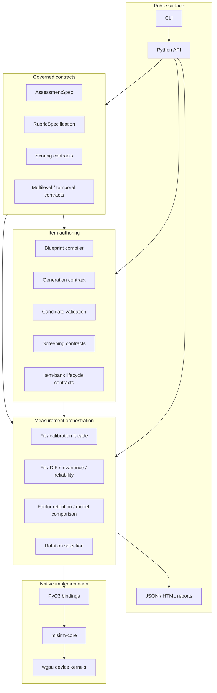
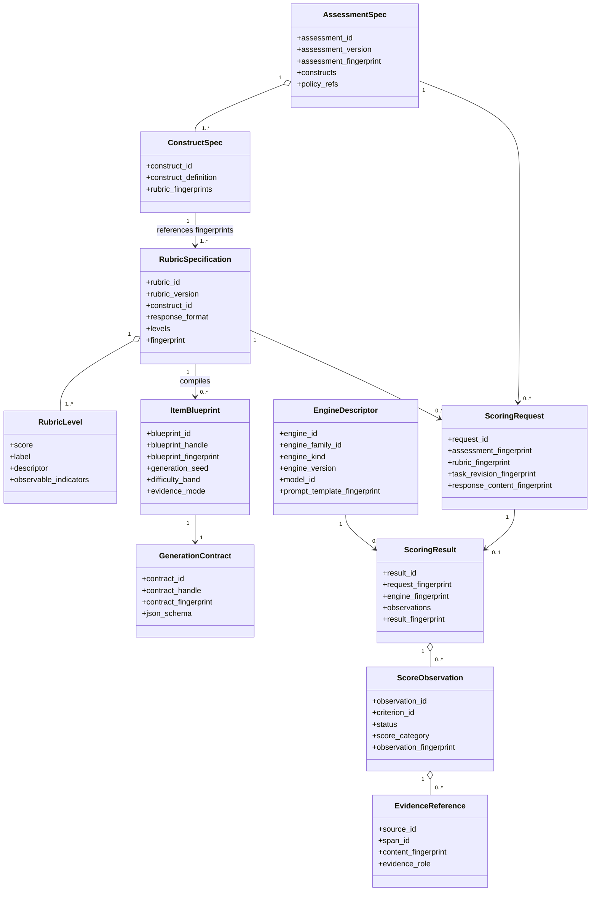
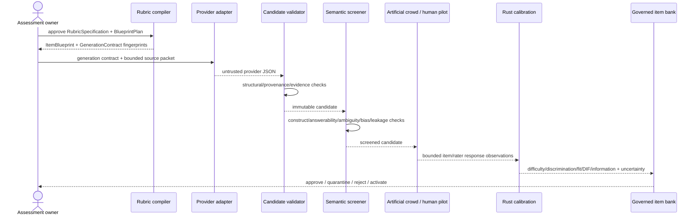
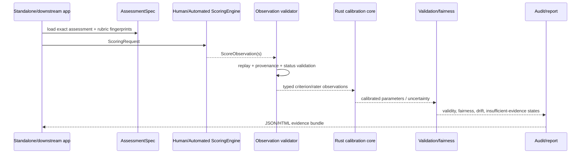
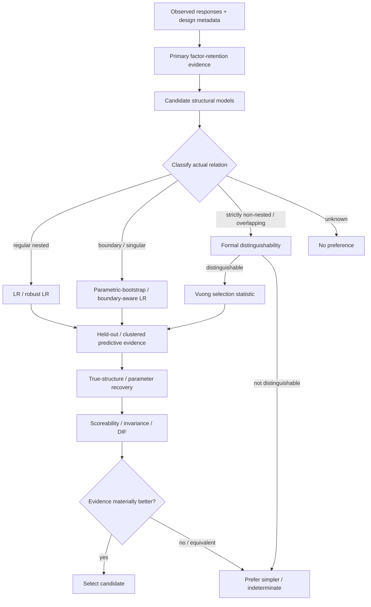
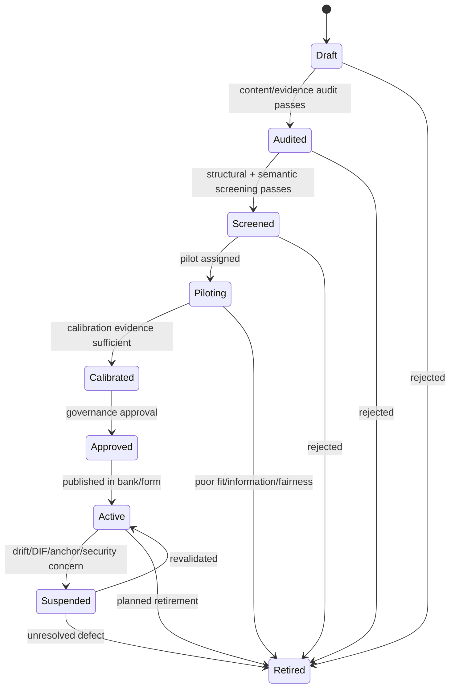
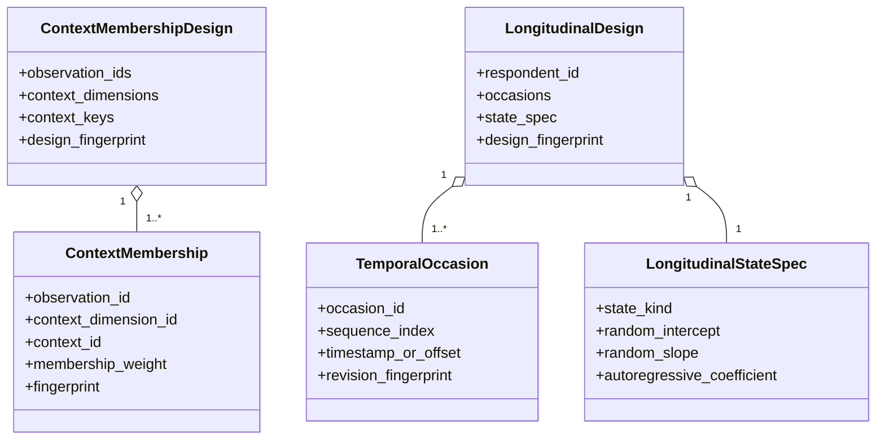
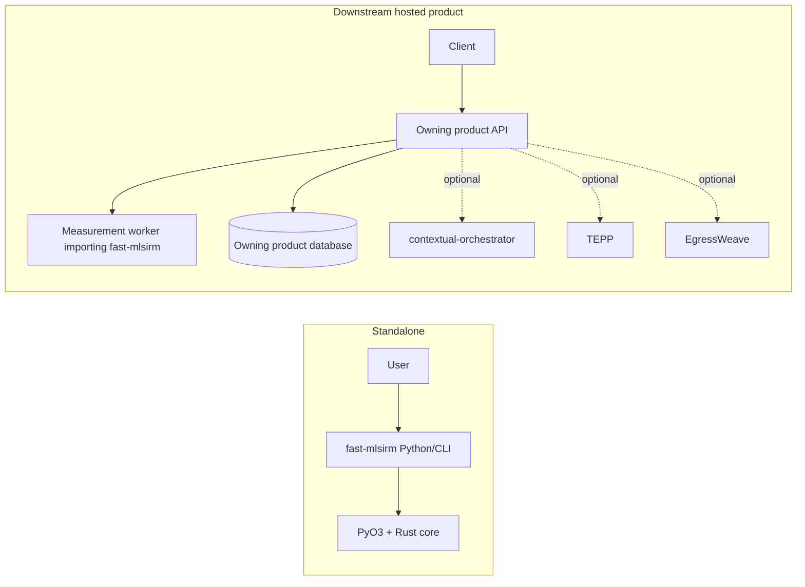

# UML and Behavioral Views — fast-mlsirm

Status: architecture companion to `ARCHITECTURE.md`  
Notation: Mermaid diagrams aligned conceptually with UML 2.5.1; diagrams are documentation models, not code-generation schemas.

## 1. Component view

## 2. Contract class view

## 3. Item-generation and calibration sequence

## 4. Scoring execution sequence

## 5. Model-selection activity view

## 6. Item-bank state machine

## 7. Multilevel and temporal contract view

The temporal model above is a contract view. A discrete occasion-step autoregressive coefficient must not be interpreted as a continuous-time process without a distinct likelihood/transition model.

## 8. Deployment view

No hosted topology in this diagram is a runtime requirement of `fast-mlsirm` itself.

## 9. Diagram maintenance rules

- Every diagram must distinguish implemented contracts from roadmap elements in the accompanying prose.
- UML/diagram element names should match public package terms when those terms already exist.
- Changes that alter bounded-context ownership, core data flow, numerical ownership, or contract identity require an ADR and updates to this file and `ARCHITECTURE.md`.
- Physical persistence belongs in downstream architecture; this repository keeps only the logical contract ERD in `docs/architecture/ERD.md`.

## Reference

Object Management Group. (2017). *OMG Unified Modeling Language (OMG UML), Version 2.5.1*.
