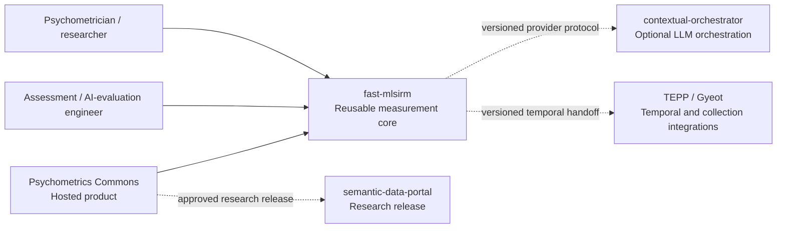
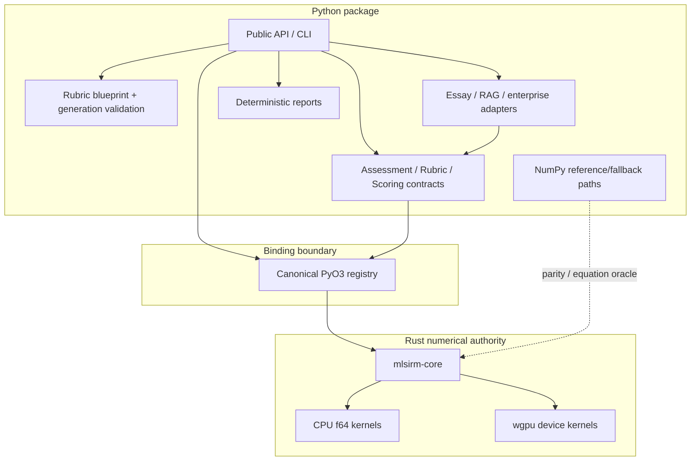
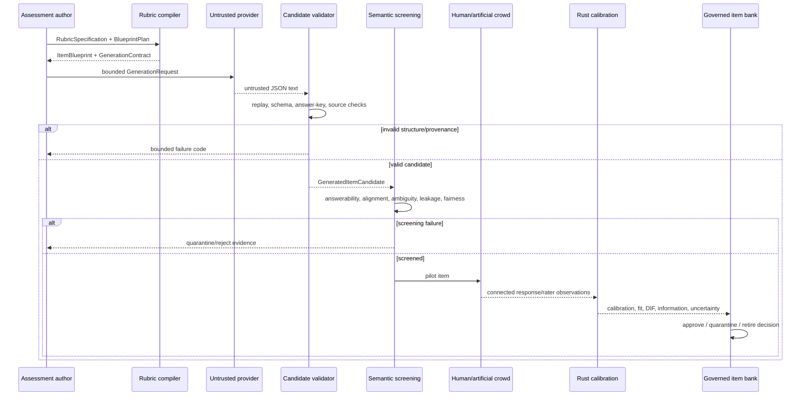
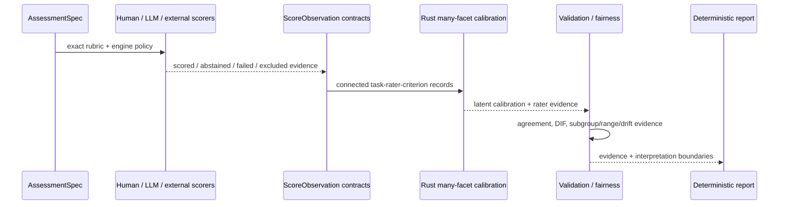
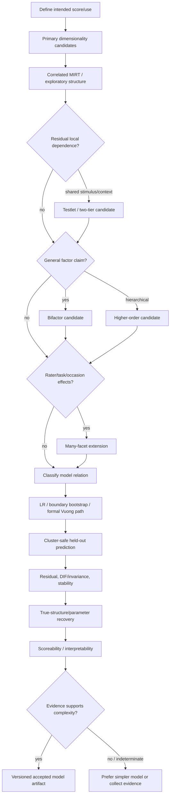
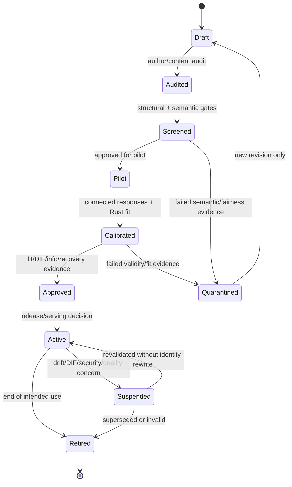
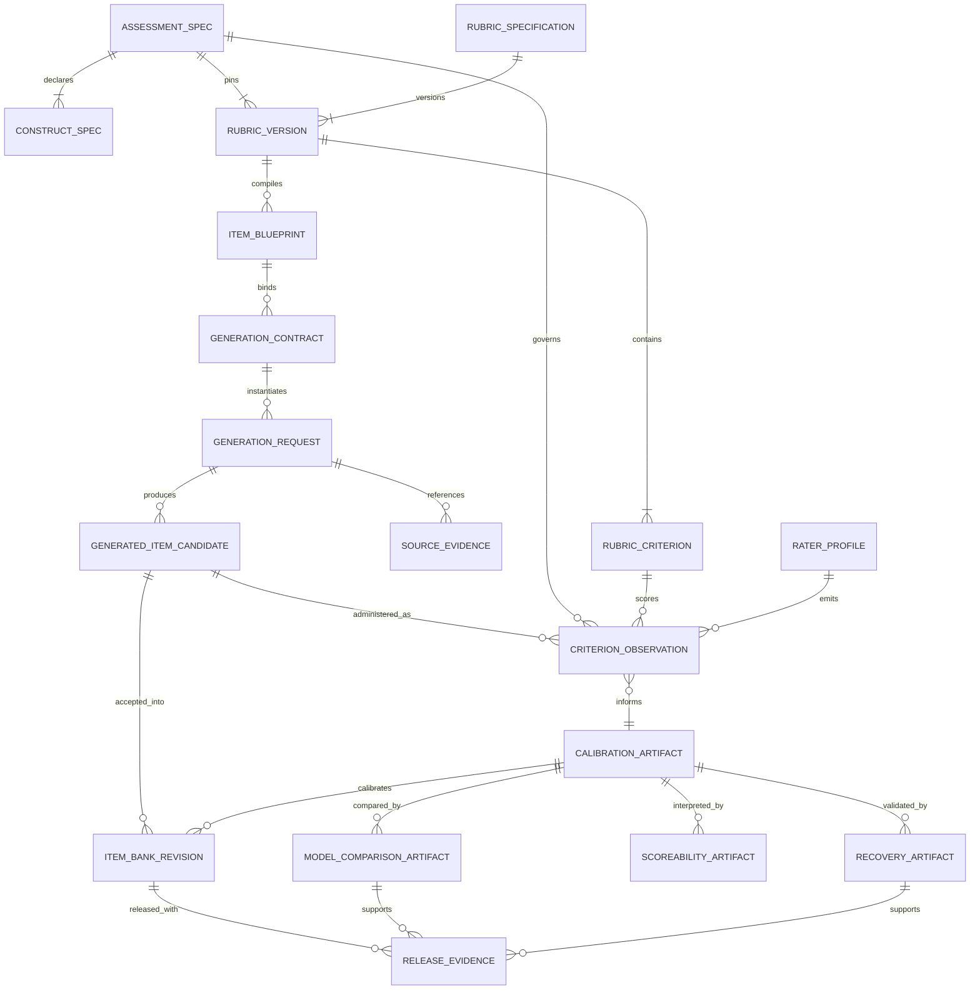
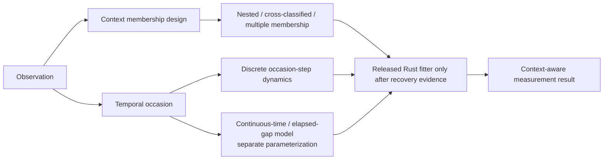

# Architecture diagrams

These Mermaid diagrams are normative views of the architecture described in `ARCHITECTURE.md`. They intentionally distinguish **implemented core**, **accepted/proposed reusable work**, and **downstream product ownership**. The ERD is logical: it models immutable artifacts and provenance, not a hosted ORM/database schema.

## 1. C4-style system context

`fast-mlsirm` does not own Commons' HTTP/session/consent/product database.

## 2. Component view

## 3. Rubric-to-governed-item sequence

The current protected package implements the rubric/compiler/provider-validation boundary and many downstream calibration primitives. A complete hosted bank workflow is an accepted product direction, not a claim that this repository owns hosted persistence.

## 4. Automated scoring / fallible-rater sequence

## 5. Measurement-model selection flow

A latent-space residual interaction is added only after substantive dimensions/facets/testlets when residual evidence justifies it.

## 6. Governed item-bank state machine

Accepted item content is immutable. Repair creates a new revision/fingerprint rather than rewriting history.

## 7. Logical artifact ERD

Entity names describe logical canonical artifacts only. A downstream service may map them to differently named persistence objects as long as exact identities and relationships are preserved.

## 8. Multilevel and temporal handoff

The diagram records the required modeling boundary. It does not mark an unmerged dedicated multilevel/longitudinal namespace as released.

## 9. Release and provenance flow

```mermaid
flowchart LR
    Head[Exact protected head] --> CI[CI + security + owned coverage]
    CI --> Package[Rust/PyO3/wheel/package acceptance]
    Package --> Sci[Required recovery / scientific studies]
    Sci --> Review[Independent review + zero actionable findings]
    Review --> Prov[SBOM / provenance / immutable artifact identity]
    Prov --> Release[Version + CHANGELOG + release artifact]
    Release --> Verify[Install/execute released artifact verification]
```

Skipped, pending, predecessor-head, stale-base, synthetic-only, or missing evidence does not satisfy a release edge.
