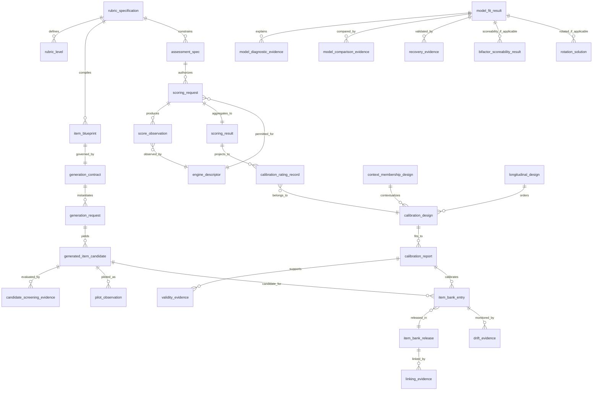

# Logical Data / Artifact Model

**Status:** Authoritative logical ERD for `fast-mlsirm`  
**Important:** This is **not** a hosted-product database schema. It documents
versioned in-memory/serialized measurement artifacts and their provenance. Hosted
persistence belongs downstream unless a future ADR explicitly changes ownership.

## 1. Entity status

| Logical entity family | Status | Owner / note |
|---|---|---|
| `rubric_specification`, `assessment_spec` | Implemented | canonical reusable measurement contracts |
| `scoring_request`, `score_observation`, `scoring_result`, `engine_descriptor` | Implemented | shared human/automated scoring boundary |
| `item_blueprint`, `generation_contract` | Implemented | rubric-centered generation contract surface |
| source/request/candidate execution artifacts | Implemented/evolving | untrusted generation trust boundary; exact names follow live API |
| essay/enterprise scoring and calibration artifacts | Implemented | domain adapters over shared scoring contracts |
| `model_fit_result`, diagnostic/recovery/linking evidence | Implemented | measurement/scientific evidence families |
| `bifactor_scoreability_result`, `rotation_solution` | Implemented/evolving depending exact release | numerical diagnostic families; authoritative API is protected main |
| contextual/membership/occasion/longitudinal artifacts | Active PR / planned convergence | reusable design contracts, not hosted persistence |
| governed item-bank release/lifecycle artifacts | Planned convergence | ADR-0009 target architecture |

Where an exact class name differs from this logical label, code is authoritative
and the traceability matrix must be updated. This document uses two-or-more-word
`snake_case` logical names so it can also constrain any future persistence design.

## 2. Logical ERD

Entities at the lower-right governed-item-bank boundary are the accepted target
architecture and must not be described as protected-main implementation until the
corresponding API is accepted.

## 3. Canonical relationship rules

### 3.1 Rubric and assessment

- A `rubric_specification` has a semantic/version identity and full content
  provenance.
- `assessment_spec` references the exact rubric definition rather than copying an
  incompatible rubric schema.
- A rubric revision creates a new identity; old observations are not silently
  re-signed.

### 3.2 Generation

- An `item_blueprint` is derived deterministically from a rubric/blueprint plan
  and preserves exact rubric provenance.
- A `generation_contract` fixes response format, scoring/answer-key structure,
  resource bounds and schema rules before provider execution.
- A `generation_request` binds exact contract, blueprint, source/evidence and
  provider/seed identity.
- A `generated_item_candidate` cannot become trusted by echoing IDs; the parser
  replays/rebinds canonical provenance.
- `candidate_screening_evidence` is distinct from structural parse success.

### 3.3 Scoring

- `scoring_request` binds the assessment/rubric/construct/task/criterion and the
  authorized human/automated engine policy.
- `score_observation` binds one package-managed observation to the exact request,
  engine/rater and evidence identity.
- Terminal observation state (`abstained`, `failed`, `excluded`) is not a numeric
  low score.
- `scoring_result` is a deterministic aggregate/provenance envelope; it does not
  erase criterion-level observations.

### 3.4 Calibration and validation

- Rating projections preserve respondent/task-revision/rater/criterion identity.
- A calibration design may be sparse but must satisfy the identification/
  connectedness requirements of the estimator before fitting.
- Calibration and validation evidence never retroactively changes the raw scoring
  observation.
- Rater severity/range/agreement evidence and measurement-model fit are distinct
  evidence types.

### 3.5 Model, recovery and selection evidence

- `model_fit_result` identifies the model family/parameterization and exact data/
  design contract used.
- `recovery_evidence` binds known truth, alignment/linking convention, estimator
  identity and bias/RMSE/coverage/convergence results.
- `model_comparison_evidence` records model relation, inferential method, cluster
  unit and predictive evidence; it may be intentionally indeterminate.
- `bifactor_scoreability_result` is interpretation evidence, not a model winner.
- `rotation_solution` records criterion/transform/multi-start/stationarity/basin
  evidence and does not claim universal optimality.

### 3.6 Context and time

- A context level is identified by `(context_dimension_id, context_id)`, not by a
  bare label.
- Multiple-membership weights are explicit and versioned.
- `longitudinal_design` preserves respondent, occasion order/time and state-model
  specification. Ordering metadata alone does not imply a continuous-time model.

### 3.7 Governed item bank

The planned governed bank separates mutable operational state from immutable
release identity:

- `item_bank_entry` may carry workflow state and references to immutable item/
  calibration versions;
- `item_bank_release` is immutable and content-addressed;
- `linking_evidence` is required before comparing materially revised forms on a
  common scale;
- `drift_evidence` may suspend/quarantine an entry but does not mutate historical
  release artifacts.

## 4. Identifiers and naming

- Public/durable identifiers SHOULD be opaque and non-sequential where practical.
- Full SHA-256/content fingerprints are used when exact identity is required.
- Display/public handles MAY be shorter only when they are not treated as the sole
  collision-resistant identity.
- If this logical model is ever persisted inside fast-mlsirm-owned reusable
  tooling, table/object names MUST contain at least two words and use
  `snake_case` by default (for example `rubric_version`, `scoring_request`,
  `calibration_report`).

## 5. Explicitly excluded hosted entities

The following are **not** fast-mlsirm data owners and therefore do not belong in
this ERD as local persistence entities:

- product tenant/account/role tables;
- Keyverse subject/federation/SCIM records;
- participant/session/consent/result-access lifecycle;
- hosted product migrations and billing;
- research participant/release workflow databases;
- UI CMS/content models.

A downstream product may reference fast-mlsirm artifact fingerprints, but that
reference does not transfer system-of-record ownership.

## 6. Privacy and provenance

Hashes and opaque identifiers are provenance mechanisms, not automatic
anonymization. Sensitive source/response content is minimized in portable evidence
artifacts, stable errors and logs. Authorization, purpose limitation, encryption,
retention/deletion and controlled egress remain required where sensitive data is
actually processed.
