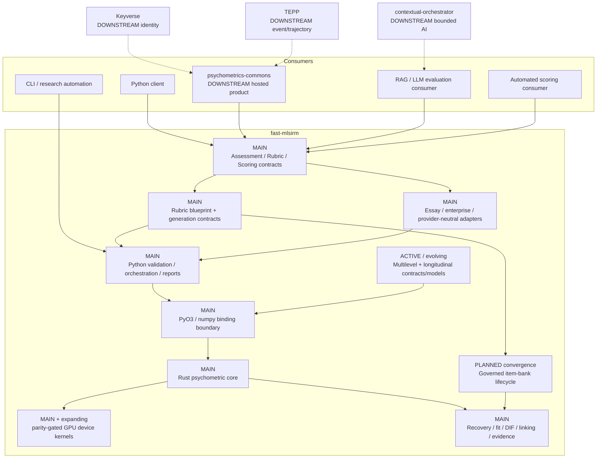
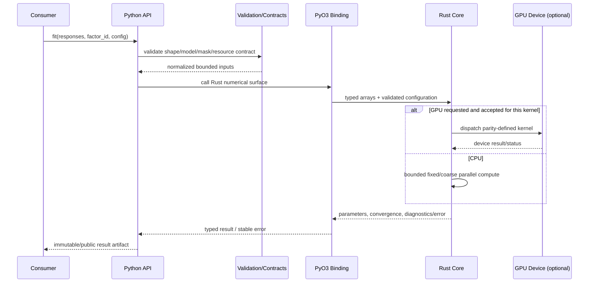
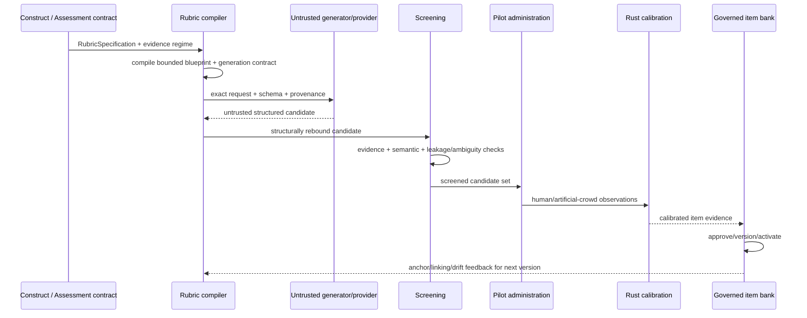
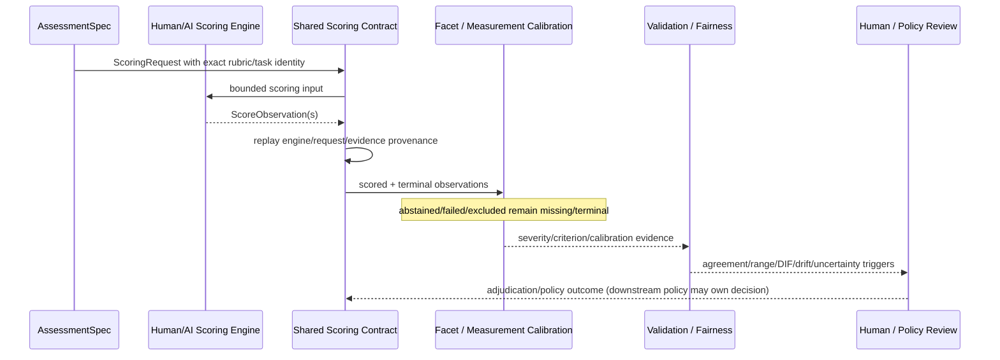
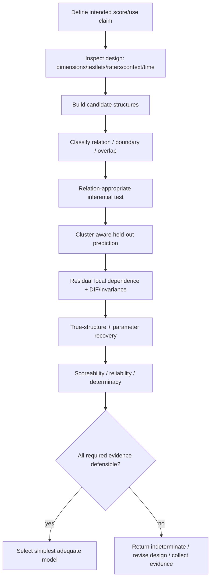
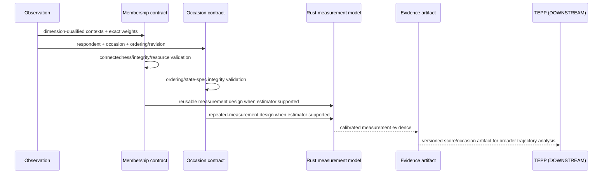
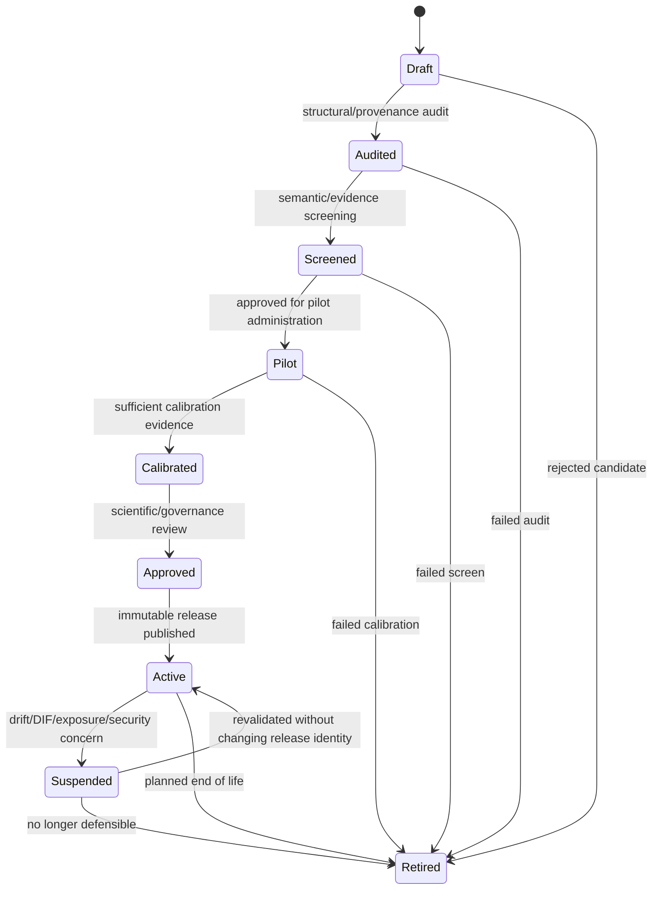
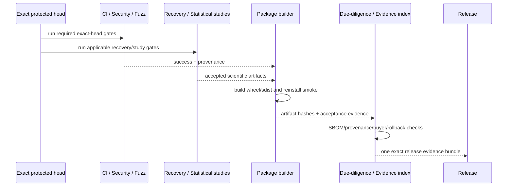
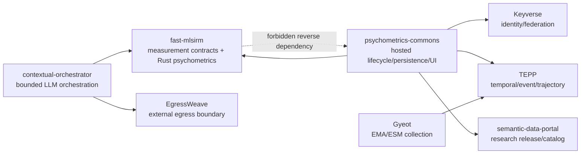

# fast-mlsirm UML / Architecture Diagrams

**Status:** Authoritative diagram set  
**Notation:** Mermaid text diagrams kept in Git for review and drift detection.

Legend used below:

- `[MAIN]` — implemented on protected `main` at the time this baseline was cut.
- `[ACTIVE]` — represented by an open PR and not yet accepted on protected main.
- `[PLANNED]` — accepted architectural direction without complete protected-main
  implementation.
- `[DOWNSTREAM]` — belongs to another repository/bounded context.

## 1. Component diagram

## 2. Numerical fitting sequence

A Python reference/fallback may be retained for explicitly documented surfaces,
but it is not an independently evolving production formula.

## 3. Rubric-to-item lifecycle sequence

The generator never directly creates an `active` item. Structural JSON validity
is not psychometric validity.

## 4. Automated scoring / rater-calibration sequence

## 5. Measurement-model selection activity

## 6. Multilevel / multiple-membership / temporal handoff

Time metadata alone does not authorize a continuous-time likelihood; the model
must explicitly implement and recover that parameterization.

## 7. Governed item-bank state diagram

A changed criterion/evidence/scoring contract creates a **new version** rather
than mutating an active release back to an earlier lifecycle state.

## 8. Release-evidence sequence

Queued, predecessor-head, cancelled or synthetic evidence cannot replace the
exact release-artifact chain.

## 9. Ecosystem boundary diagram

The final dashed edge describes a prohibited dependency, not a runtime call.
