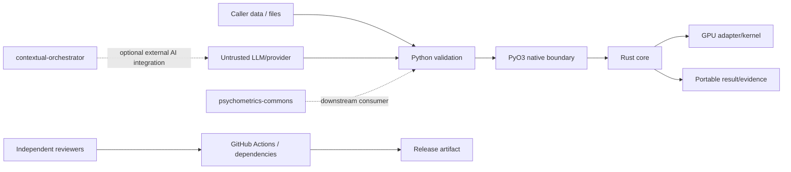

# fast-mlsirm Threat Model

**Status:** Repository-level threat model  
**Last reviewed:** 2026-08-09

This document covers the reusable `fast-mlsirm` package and its build/release
process. Hosted tenant/session/identity/network threats belong primarily to
Psychometrics Commons, Keyverse, EgressWeave or the owning deployment service.

## 1. Assets

- correctness of psychometric likelihoods, gradients, diagnostics and recovery;
- exact Assessment/Rubric/Scoring contract and item-bank identities;
- input response/rater/source evidence and sensitive metadata;
- release artifact, SBOM/provenance and scientific evidence integrity;
- public API/schema compatibility;
- CI/reviewer trust boundaries and model-execution credentials;
- computational availability of Python/Rust/GPU execution.

## 2. Trust boundaries

Every solid arrow crosses a validation or execution boundary. A successful
provider call is not equivalent to trusted measurement evidence.

## 3. Principal threats and controls

| Threat | Example | Required controls / evidence |
|---|---|---|
| Untrusted JSON ambiguity | duplicate key changes answer key | RFC 8259-compatible strict parser, duplicate-key rejection, closed schemas, bounded payload, JSON Schema parity |
| Provenance replay/confusion | candidate from rubric A attached to rubric B | full request/rubric/blueprint/source/engine fingerprints, canonical reconstruction, immutable artifacts |
| Constructor/child mutation | forged dataclass/frozen-child replacement | package-owned factory/seal/replay checks at aggregate boundaries |
| Prompt injection / rubric execution | evidence text tells generator/judge to ignore contract | treat evidence/rubric text as inert data, closed output contract, exact prompt/version provenance, semantic screening |
| Sensitive-data reflection | error contains raw essay/provider output | stable redacted error codes/paths, source-free portable reports where possible, bounded logging |
| Hash mistaken for anonymization | public digest enables dictionary linkage | purpose limitation/access controls; treat digest as provenance, not privacy guarantee |
| Resource exhaustion | huge matrix, JSON, dimension product or infinite iterator | pre-allocation checked products/bytes, collection/depth/string limits, iterator limit+1 strategy, timeouts/process groups |
| Native boundary abuse | invalid dtype/shape crosses PyO3 | validate dtype, dimensions, finiteness, contiguity/resource bounds before native call; Rust rechecks safety-critical invariants |
| Numeric overflow / non-finite scientific output | denominator/variance overflow silently returns 0 | checked/stable algorithms, finite-output assertions, property/extreme-value tests, true-parameter recovery |
| CPU oversubscription | nested BLAS + Rayon thrashes worker | bounded coarse workers, explicit thread evidence, benchmark actual environment, avoid nested pools |
| GPU evidence spoofing | GPU test skips or silently uses CPU | explicit adapter availability proof, no-skip gate, device/backend evidence and CPU/GPU parity |
| Scientific model misuse | non-nested statistic used for boundary-nested models | relation-safe fail-closed API, typed status, bootstrap/recovery/predictive evidence |
| Score validity overclaim | high human/AI correlation called accuracy | agreement/calibration/rater effects/DIF/recovery evidence and intended-use limits |
| Supply-chain compromise | mutable Action/dependency or PR code writes source | immutable pins where required, dependency review/OSV/Trivy/SAST/SBOM, no PR-controlled self-modifying write workflow |
| Reviewer/model credential conflation | scoring model token can approve PR | separate reviewer and model credentials, least privilege, NVIDIA NIM model auth, no `COPILOT_GITHUB_TOKEN` as model auth |
| Cross-repo authority leak | fast-mlsirm begins storing product tenant/consent | ADR-0001 boundary, architecture contract tests, public artifact integration only |
| Benchmark contamination | candidate-aware rubric used on same evaluation systems | candidate-blind benchmark mode or cross-fitting, separate benchmark/training banks, provenance |
| Item-bank semantic drift | active rubric text edited in place | immutable versioned release, linking/anchor evidence, drift/DIF monitoring, rollback history |

## 4. Privacy model

`fast-mlsirm` does not solve privacy by blanket masking values that are required
for legitimate scoring/measurement. The preferred hierarchy is:

1. collect/process only fields required by the measurement contract;
2. authorize access by purpose and owning product/service;
3. use encryption in transit/at rest in the owning deployment;
4. separate raw sensitive content from portable psychometric evidence;
5. use opaque identifiers/selective disclosure in reusable artifacts;
6. implement retention/deletion in the system of record;
7. keep logs/errors/telemetry source-free unless a controlled diagnostic workflow
   explicitly authorizes disclosure;
8. preserve auditable provenance without calling hashes anonymization.

## 5. LLM / autonomous-agent boundary

LLM output is untrusted and does not gain code/release authority by producing a
valid response. Autonomous development workflows:

- use one repository writer lease;
- inspect exact head/base/reviews/checks before writes;
- do not run PR-controlled self-modifying source generators with write tokens;
- use NVIDIA NIM/OpenCode for approved model execution and not
  `COPILOT_GITHUB_TOKEN` as model authentication;
- preserve independent reviewer identities and credentials;
- fail closed when required credentials or immutable source identity are absent;
- cannot approve their own substantive changes or bypass branch protection.

## 6. Scientific integrity threats

Scientific integrity is a security property for this package because incorrect
measurement can create consequential downstream decisions.

Controls include:

- primary-source method doctoring;
- exact parameterization/version metadata;
- true-parameter bias/RMSE/coverage/convergence tests;
- alignment-aware latent-space/rotation recovery;
- relation-safe model comparison;
- DIF/invariance/rater diagnostics;
- changelog and release evidence tied to exact artifacts;
- explicit non-claims for unsupported validity, causality, reliability or
  high-stakes deployment.

## 7. Abuse/degraded scenarios

### Provider outage or rate limit

The affected generation/judging action fails or abstains with a stable error;
existing psychometric contracts/results remain usable. Provider outage cannot
silently select a different model or approve a release.

### Malformed/hostile input

Reject before large allocation/native execution where feasible. Fuzz contracts
require either success or a documented benign exception—no panic, hang or
unexpected internal exception family.

### Dependency/security finding

Treat required scanner failures as real until RCA proves a narrow false positive.
Patch the dependency/source or record a narrowly justified suppression; do not
weaken the central gate.

### Scientific recovery regression

Stop merge/release of the affected mathematical feature, reproduce the failing
condition, determine whether implementation, model assumption or acceptance
contract is wrong, and create the smallest realistic regression. Do not tune the
threshold to the failed seed.

## 8. Framework mapping (design guidance, not certification)

- NIST AI RMF 1.0: governance, mapping, measurement and management of AI risk.
- NIST AI 600-1: GenAI-specific risks relevant to model/judge/provider use.
- ISO/IEC 42001:2023: AI management-system lifecycle reference.
- Standards for Educational and Psychological Testing: validity, fairness,
  reliability, documentation and intended score-use evidence.

These references guide controls; repository documentation does not claim SOC 2,
CSAP, ISO/IEC 42001 or other certification.
