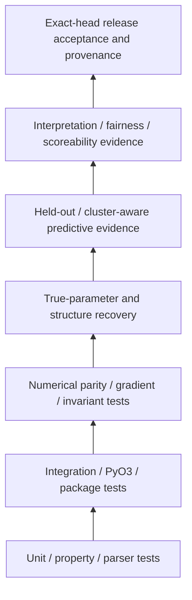

# Verification and Validation Plan — fast-mlsirm

Status: canonical V&V baseline  
Date: 2026-08-09

## 1. Purpose

This plan defines how `fast-mlsirm` establishes evidence that an implementation:

1. conforms to its declared software/contract requirements (**verification**);
2. recovers the intended scientific behavior under realistic data-generating conditions (**scientific validation**);
3. is safe and reliable enough for the package's declared use boundary without overclaiming regulated/high-stakes fitness (**product validation**).

No single metric is treated as sufficient. In particular, unit-test success, code coverage, correlation with another scorer, or in-sample model fit alone does not establish validity.

## 2. Evidence hierarchy



Evidence at a higher layer may depend on lower layers but does not erase lower-layer failures.

## 3. Verification classes

### VV-SW-001 — Unit and public-contract tests

Every public contract and stable failure mode shall have deterministic unit tests covering:

- normal construction/use;
- empty/minimum/maximum boundaries;
- invalid types, Boolean-as-integer, non-finite values, malformed IDs;
- duplicate/conflicting values;
- post-construction mutation/replay where relevant;
- stable non-reflective error codes/paths;
- immutable/canonical output semantics.

### VV-SW-002 — Property and metamorphic tests

Use invariants when one example cannot establish correctness, including:

- order-insensitive canonicalization where specified;
- score/likelihood invariance under valid label/sign/permutation transforms;
- global count-scale invariance where the estimator mathematically has it;
- covariance preservation under valid factor rotation;
- linking transformation identities;
- seed and thread-count determinism where promised;
- round-trip serialization/replay.

### VV-SW-003 — Python↔Rust delegation and parity

For Rust-owned features:

- Python public API must be shown to delegate to the intended native surface;
- independent reference/oracle comparisons use tolerances justified by precision/algorithm;
- validation errors and result fields must preserve typed semantics across PyO3;
- Python wrappers must not recompute production statistics to work around a native error.

### VV-SW-004 — CPU/GPU evidence

A GPU claim requires:

- an actual GPU/device adapter selection in the test evidence;
- a test that fails when GPU execution is skipped if the gate claims GPU evidence;
- CPU/GPU objective/result/recovery parity appropriate to non-identifiability and precision;
- bounded memory/resource behavior;
- no separate formula/interpretation semantics.

### VV-SW-005 — Packaging and import

Supported release environments require:

- source/editable build where advertised;
- wheel/sdist build and metadata validation;
- compiled PyO3 import;
- package-root public exports;
- binding-crate tests when omitted from root workspace;
- dependency/lock integrity;
- clean installed-environment smoke tests.

### VV-SW-006 — Security and adversarial tests

Cover the threat model's relevant boundaries:

- hostile iterables/subclasses/conversions;
- excessive dimensions/allocations;
- duplicate/unknown JSON fields and non-finite JSON;
- evidence/source span spoofing;
- path traversal/symlink/race boundaries in tooling;
- secret-shaped subprocess/model-provider failures;
- stale/replay provenance;
- prompt-injection content treated as inert data;
- no PR-controlled self-modifying writer workflow.

## 4. Scientific validation classes

### VV-SCI-001 — Parameter recovery

Where true parameters are known, report as applicable:

\[
\operatorname{Bias}(\hat\psi)=E(\hat\psi-\psi)
\]

\[
\operatorname{RMSE}(\hat\psi)=\sqrt{E[(\hat\psi-\psi)^2]}
\]

and interval/SE coverage, convergence/failure rate, boundary behavior, and decision-relevant function recovery.

Before computing component-wise recovery, align non-identified representations:

- IRT location/scale linking;
- MIRT sign/rotation/permutation;
- latent-space Procrustes or invariant pairwise distances;
- factor-rotation sign/permutation alignment.

A high Pearson/Spearman correlation is supplementary and cannot replace absolute recovery.

### VV-SCI-002 — Response/information recovery

When downstream use depends more directly on response functions/information than raw parameters, evaluate:

- ICC/category response probability error;
- item/test information recovery;
- posterior/score calibration;
- cut-score/classification consistency;
- CAT item-selection regret/length when relevant.

### VV-SCI-003 — Factor retention recovery

Candidate factor-retention procedures shall be evaluated under realistic combinations of:

- sample size;
- item/variable count;
- factor count and correlation;
- weak/minor/cross loadings;
- response type/category count;
- nonnormality/missingness;
- local dependence/testlets;
- multilevel/rater structure.

Report selection confusion matrices rather than one average accuracy when multiple true structures are simulated.

### VV-SCI-004 — Structural model recovery

For correlated MIRT, bifactor, higher-order, testlet, two-tier, multifaceted, and latent-space candidates:

- test whether the intended relation classifier is correct;
- assess formal-test Type I/selection behavior under the appropriate relation;
- compare held-out/cluster-aware predictive likelihood;
- evaluate residual local dependence;
- recover structural/loadings/rater/testlet/interaction parameters;
- evaluate scoreability/invariance before authorizing score interpretation.

### VV-SCI-005 — Bifactor scoreability

When a bifactor solution is used for scores, evaluate the indicators appropriate to the score representation, including ECV/PUC, omega hierarchical/general and subscale evidence, construct replicability/factor determinacy, stability, and external incremental validity when available. A fit improvement alone does not authorize a total/subscale score.

### VV-SCI-006 — Rotation recovery

Adaptive rotation shall be evaluated with known population loadings/targets using:

- Tucker congruence after globally optimal factor assignment/sign alignment;
- loading RMSE/target RMSE where identified;
- bootstrap/split-sample stability;
- solution-basin support/entropy;
- criterion-selection frequency by population condition;
- factor-correlation and degeneracy diagnostics.

The term "best observed" is used for finite multi-start results; global optimality is not claimed.

### VV-SCI-007 — Multilevel/multiple-membership recovery

Validation data must reproduce the real design features:

- cluster/context dimensions;
- cross-classification;
- membership weights;
- unbalanced group sizes;
- sparse/disconnected assignment patterns;
- rater/task facets when relevant.

Compare parameter/SE/coverage behavior against atomistic misspecification so the benefit of the structure is empirically demonstrated.

### VV-SCI-008 — Temporal/longitudinal recovery

Validate ordering, missing occasions, unequal follow-up patterns, drift/state parameters, random intercept/slope effects, and revision boundaries. A discrete-step model is evaluated by step count. The joint MAP hierarchical CT-AR Rasch slice must include interval-sensitive generating processes and recovery of known states and `(mu, tau, lambda)` against honest MAP RMSE/coverage bounds. Estimated multiple-membership `u_h` remains a later recovery target.

## 5. Automated scoring / LLM-as-a-Judge validation

### VV-AI-001 — Rater calibration

Human and LLM scorers are treated as fallible raters. Evidence should include:

- rater severity;
- criterion-specific effects;
- discrimination/consistency/range-use where modeled;
- prompt/order/occasion drift;
- connectedness of the assignment graph;
- agreement metrics only as descriptive companions.

### VV-AI-002 — Agreement and absolute error

When a defensible target or audited score exists, report an appropriate set of:

- bias/MAE/RMSE;
- exact and adjacent agreement;
- QWK;
- absolute-agreement ICC or concordance where appropriate;
- Bland-Altman or conditional-error evidence;
- calibration slope/intercept for probabilistic outcomes;
- subgroup/score-region errors.

### VV-AI-003 — Construct and shortcut validity

Test that automated scorers respond to construct-relevant changes and resist construct-irrelevant shortcuts, including where appropriate:

- evidence insertion/removal;
- unsupported claims/contradictions;
- citation swaps;
- paraphrase/order invariance;
- verbosity/length perturbations;
- unanswerable cases and abstention;
- adversarial/prompt-injection content;
- language/domain subgroup shifts.

### VV-AI-004 — Reference-free RAG evaluation

Reference-free means no gold answer is required for some constructs; it does not mean truth is known. Validation must distinguish:

- context groundedness;
- query/answer relevance;
- retrieval relevance/utilization;
- correctness against an authoritative/pooled evidence regime when available;
- completeness/obligation coverage proxy;
- robustness and abstention.

RAG candidate answers must not be used to discover the final benchmark rubric unless the design uses explicit cross-fitting or separate discovery/evaluation banks.

### VV-AI-005 — Rubric/item generation

Validate the item/rubric lifecycle in layers:

1. structural schema/provenance;
2. evidence/source correctness;
3. construct alignment/atomicity/ambiguity/answerability;
4. duplication/leakage/bias/adversarial risks;
5. artificial-crowd/human pilot;
6. item fit/information/DIF/local dependence;
7. linking/anchor/version evidence;
8. operational exposure/drift/retirement.

## 6. Generalization and resampling design

Random response-cell splitting is prohibited when it leaks the same person/query/testlet/rater/domain/occasion across train and validation in a way inconsistent with the intended generalization claim.

Use the unit matching the claim, for example:

- leave-person/system-out;
- leave-query/testlet-out;
- leave-rater/family-out;
- leave-domain/language-out;
- temporal forward validation;
- cluster/bootstrap blocks aligned to the dependency structure.

## 7. Coverage policy

Owned production code targets 100% statement and branch coverage plus function/line/region coverage where available. Coverage is necessary but not sufficient:

- exclusions cannot hide production behavior;
- a test that only executes a line without asserting the contract is inadequate;
- fail-first tests must reach the intended production boundary rather than fail during setup/import/fixture construction;
- documentation, schema and workflow contracts may use source/structure tests when runtime instrumentation is not meaningful.

## 8. Performance and resource validation

Performance work must record:

- environment/hardware/toolchain;
- problem shape and data type;
- warmup/repetition/statistical summary;
- peak workspace/allocation evidence when relevant;
- numerical equivalence/recovery evidence;
- CPU thread count / GPU adapter and precision;
- no universal speed claim outside the measured environment.

Memory/resource limits are product requirements when caller-controlled dimensions can produce denial of service.

## 9. Release V&V gate

A release candidate must bind evidence to one exact protected source head and exact artifacts. Required categories include as applicable:

- Python tests and coverage;
- Rust workspace tests, clippy/rustdoc where policy requires;
- PyO3 binding tests/import;
- package/wheel/sdist build/reinstall;
- explicit GPU evidence for GPU claims;
- fuzz/property/security scans;
- dependency/SBOM/provenance evidence;
- accessibility/exact-value report regressions;
- changelog/version correctness;
- method/recovery evidence for changed scientific behavior;
- zero valid unresolved current-head review findings;
- independent approval where required by policy;
- release acceptance/buyer evidence generated from the exact artifact.

Queued, pending, cancelled, skipped-required, predecessor-head, synthetic-only, status-only, or stale-base evidence is not passing evidence.

## 10. Failure triage

Every failing gate is classified before remediation:

```text
symptom
→ exact first failing boundary
→ immediate cause
→ technical root cause
→ systemic/control cause if material
→ correction owner
→ smallest feasible fix
→ focused RED/GREEN
→ full exact-head evidence
```

A setup/test-harness defect must be fixed before changing production code based on that failure. A central infrastructure/reviewer methodology defect is not repaired by weakening a product test.

## 11. Documentation evidence

Documentation is subject to V&V:

- canonical architecture documents must exist and remain internally consistent;
- Mermaid/diagram source must be parseable by the supported renderer in CI/review when tooling is available;
- PRD/TRD/ADR requirements must be traceable to implementation/evidence maturity;
- source/standards claims must be verified and citations kept current;
- planned features must not be described as protected-main capabilities;
- superseded material must be removed or explicitly marked.

`tests/test_architecture_documentation_contract.py` is the initial executable regression for this architecture spine.

## 12. References — APA 7th

American Educational Research Association, American Psychological Association, & National Council on Measurement in Education. (2014). *Standards for educational and psychological testing*. American Educational Research Association.

Bland, J. M., & Altman, D. G. (1986). Statistical methods for assessing agreement between two methods of clinical measurement. *The Lancet, 327*(8476), 307–310. https://doi.org/10.1016/S0140-6736(86)90837-8

Kane, M. T. (2013). Validating the interpretations and uses of test scores. *Journal of Educational Measurement, 50*(1), 1–73. https://doi.org/10.1111/jedm.12000

Schneider, L., Chalmers, R. P., Debelak, R., & Merkle, E. C. (2020). Model selection of nested and non-nested item response models using Vuong tests. *Multivariate Behavioral Research, 55*(5), 664–684. https://doi.org/10.1080/00273171.2019.1664280

Svetina, D., Valdivia, A., Underhill, S., Dai, S., & Wang, X. (2017). Parameter recovery in multidimensional item response theory models under complexity and nonnormality. *Applied Psychological Measurement, 41*(7), 530–544. https://doi.org/10.1177/0146621617707507

Williamson, D. M., Xi, X., & Breyer, F. J. (2012). A framework for evaluation and use of automated scoring. *Educational Measurement: Issues and Practice, 31*(1), 2–13. https://doi.org/10.1111/j.1745-3992.2011.00223.x
